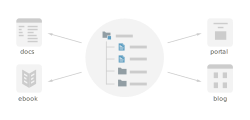
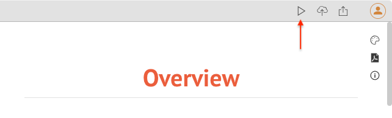
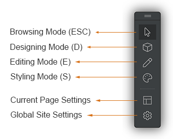

# Overview

Most of us struggle to keep our websites up-to-date. New blog posts, archives, and other documents are hard enough to create without worrying about how you are going to integrate them into your online presence.

All existing solutions require a complicated process to set up a website so that we can create content. The steps to update content are tedious as well, and the UI is often overwhelming.

Aiming to making our own lives easier, we created Document Node, a lightweight, fast, and native application, to simplify everything from writing to publishing.

This page only highlights a few of the most exciting features of Document Node. For more details, please feel free to navigate the docs from the left side table of contents.

## Distraction-free writing

Document Node provides a distraction-free writing space. When you enter the focus mode, everything but the text editor will be hidden. Your writing thoughts will naturally flow without any interruption.

## One-click to generate website

When you finish writing and want to see how it looks on a website, click the 'Run' button from the top right corner. A fully functional website will be generated and run for you automatically.

If you then go back to the Document Node text editor and continue editing, all changes will be updated to the website in real-time.

One feature that should be extremely useful for documentation writing is the folder structure refactoring. That is, the folder structure directly maps to the navigation of your documentation site. When you change the folder structure via drag-and-drop, the navigation of your documentation website will be updated simultaneously.

## Offline site builder

Once the website is ready, you may want to change the top-level menus, background colors, footer links, site logos, creating more custom pages, and so on. Everything like this can be done quickly on the spot, using the offline site builder.

The site builder toolbar shown above enables us to switch among a few modes:

* In `Browsing Mode (ESC)`, everything is the same as your final web site. You can browse different web pages as usual.
* In `Designing Mode (D)`, we can change the current page layout by adding, updating, or deleting page blocks
* In `Editing Mode (E)`, we can change texts, links, images
* In `Styling Mode (S)`, we can change text colors, background, etc.

As shown above, keyboard shortcuts for different modes are available. Press `ESC` to switch back to the normal browsing mode, and press `D`, `E`, or `S` (if not typing in an input box) to switch to the designing mode, editing mode, or styling mode respectively.

Additionally, we can change the current page settings and global site settings from the toolbar.

This toolbar will be gone when you export your folder into a clean website, which will be ready for uploading to a hosting service.

## Exporting

At the moment, we can export a document folder into a website, or one or more PDF files.

The exported website folder contains everything you need to share with the public. The paths used in pages are relative, which means you can upload the site folder to whichever static site hosting directly.

A document folder can be exported into a single PDF file, which is helpful when you are writing an ebook because you can break up sections into separate Markdown files when writing, and eventually you get a single PDF automatically. Alternatively, you can export as multiple PDF files, where each document file will be generated into a separate PDF file. The use case would be to add the PDF files to your documentation website so that users can only download the one that they need.

## Publishing

After you have exported your document folders as websites, you can upload them to third-party static site hosting services, such as S3, Github pages.

One of the most exciting abilities of Document Node should be the one-click publishing! Once you finish creating or modifying your website, click the `Publish` button and give it a subdomain and a custom domain (optional), your website will be published in a few seconds.

Each time when you change your website, use the same button to publish the differences. From now on, every corner of your website can be updated effortlessly.

## Summary

Document Node makes it intuitive for us to create and update any content websites. It leverages the native application performance and instant website generation to maximize your writing productivity.

What you see in the current version of Document Node is only the tip of the iceberg of our development road map. Please expect more and more features around writing and publishing to be rolled out gradually.
