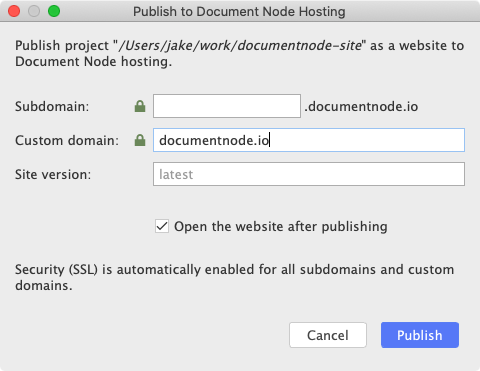

# Publishing websites

#Site/Builder 

Once you finish creating or modifying your website, click the `Publish` button and give it a subdomain and a custom domain (optional), your website will be published in a few seconds.

Each time when you change your website, use the same button to publish the differences. From now on, every corner of your website can be updated effortlessly.

## Subdomain

A valid subdomain is required to publish websites to Document Node hosting. It can be any valid names that are not taken by someone else or reserved.

## Custom domain

A custom domain is optional and can only be specified by users who have subscribed to at least `Creative` plan.

For more details about how to configure your DNS record, please head to the [Custom domain](Custom%20domain.md) page.