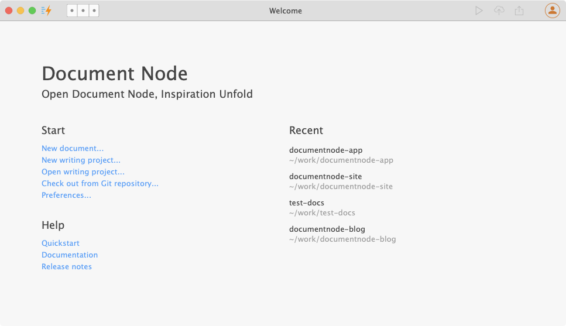
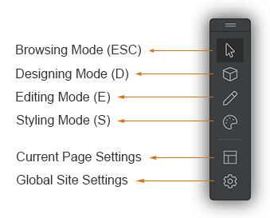

# Quick-start

Document Node simplifies the process from writing to publishing. Unlike all existing solutions available on the market, Document Node allows you to concentrate on your content from the beginning, and get a beautiful website, as well as other formats like PDF or eBook and so on, automatically from your document folder.

## Installing Document Node

Installing Document Node is easy on all platforms. It follows the installation standard of the underlying operating system.

### On macOS

On macOS, once you have downloaded the DMG file, double-click on it.

And then, drag and drop Document Node to the `/Applications` folder.

### On Windows

For Windows, we have provided an MSI installer, which will guide you to install Document Node step by step.

You can also use the portable version, which is a ZIP file. After you've downloaded it, unpack the application folder to any location of your disk. And then double-click `Document Node.exe` to launch the application.

### On Linux

For Linux platforms, Document Node is packaged as an [AppImage](https://appimage.org/), which means Linux users can download the AppImage and run it directly on their desktop system just like we would do with a Windows or Mac application. No need to install anything. No system libraries or system preferences are altered.

## Starting content creation

When the first time you've launched Document Node, you will see a welcome page, where you can create a document, create a new project, or open an existing project directly.

We are trying hard not to invent any new terminologies so that users can start benefiting from the software quickly. Perhaps `project` is the only terminology you need to understand at the moment. But it will be straightforward.

> A **project** in Document Node is just an ordinary folder on your disk, where you put your plaintext content in.
> 
> You can organize your plaintext files into different folders for different purposes. For example, one folder for your company website, the other folder for your new book.
> 
> In Document Node, we call such top-level content folders **projects**.

When creating a new document with no project specified, the default project at `~/My Writings` will be used.

## Running as a website

Once you finish your writing, click the `Run` button on the top right corner, you will get a website with all default settings automatically.

The website will be opened in your web browser. From there, you can change everything quickly, including:

* Page layouts
* Page data (images, texts, links etc.)
* Page styles
* Creating new pages

There are four modes you can use to customize your pages. In `Designing Mode`, you will be able to add/remove/change page blocks. In `Editing Mode`, you can change page text via inline-editing, and change text links, images, and so on in popups. In `Styling Mode`, you can modify color, size, and background of page elements.

In `Browsing Mode`, you can navigate the website in the usual way, which means clicking a link will direct you to a different page.

## Exporting

Once you have finished writing and are ready to deliver to your readers, you can export your project as a clean website, or PDF files.

The clean website exported is ready to be uploaded to any third-party static site hosting services. And the PDF files with bookmarks are ready to be sent to your audience.

For more information, please see the [Exporting](Writing/Exporting.md) page.

## Auto-update

As we keep adding new features into the product and fixing bugs frequently, it's essential that users can get the latest version as soon as possible.

Auto-update has been fully supported on macOS version and Windows version, and the update notification has been enabled for the Linux version as well.

To check updates, on macOS go to the `Document Node` application menu, and select `Check for Updates...`, on Windows or Linux, choose `Help` -> `Check for Updates...` menu.

## Getting support

Now you are all set to create your content. If you have any questions or need any help, please don't hesitate to contact us, through the email (*support* [at] *documentnode* [dot] *io*).

Or, you can easily send any messages to us from the application menu: `Help` -> `Send Feedback...`. 

We are always here waiting to help you.

