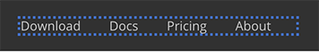

# Inline editing

#Site/Builder

Instead of using a complex admin UI to configure the page data, inline editing is the most straightforward way to go. When you spot something you want to change, just click and modify it. No need to jump to a different place.

## Enable editing

Enable `Editing Mode` from the site builder toolbar, then we can edit the page data easily in place. Press the `ESC` key to go back to the `Browsing Mode`.

In `Editing Mode`, when you move your mouse over an element, if it's editable, you will see a blue dotted border.

## Normal text

For text labels or paragraphs, you can click it and edit directly. To finish editing, press `Ctrl+Enter` or click elsewhere on the page.

For other elements like images or links, you will see a properties dialogue pops up, and you can update the data there.

## Image properties editor

To edit an image, click on it and the `Image Properties Editor` will popup.

From there, we can change the image source and alternative text.

It's also possible to remove the image from the `Image Properties Editor` by setting the image source to `none`. If we change our mind, we can bring back the default image by clicking the page block and select the `Reset Empty Properties` menu.

## Links editor

To edit text links such as top menus or footer links, click on it and the `Text Links Editor` will pop up.

From there, we can change the text and URL of the links, reorder the link, or add new text links.

It's also possible to remove all links from the `Text Links Editor`, for example, sometimes we don't want to have the 'Login' button on the top menu at all. If we change our mind, we can bring back the default links by clicking the page block and select the `Reset Empty Properties` menu.

## Other data editor

Our goal is to allow users to edit the data of all blocks easily. Therefore, improving the data editing ability is one of our primary tasks in our TODO list.

Please keep your Document Node up to date so that you can benefit from the latest improvements and new features.
