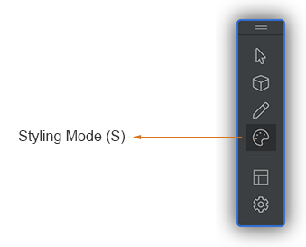
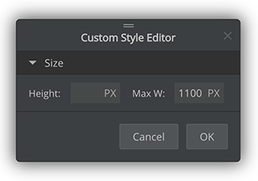
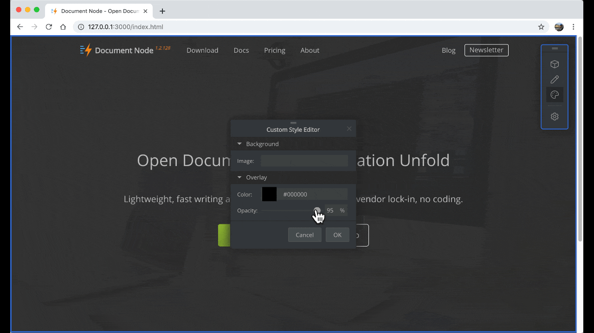

# Inline styling

In addition to changing page layouts and updating page data, with the offline site builder, you can also change the style of your page elements in place.

## Enable styling

To enable `Styling Mode`, click the colour palette icon on the site builder toolbar. Press the `ESC` key to go back to the `Browsing Mode`.

In `Styling Mode`, when you move your mouse over an element, if it's stylable, you will see a blue dotted border.

Click the element to change style properties in the `Custom Style Editor` dialogue.

## Style properties

Depending on which page element you are styling, the editable style properties in the `Custom Style Editor` may be different.

As all pre-defined page blocks provided by Document Node are carefully designed and mobile-friendly, not all style properties are necessary to be changed. Therefore, only a subset of style properties can be edited for most page blocks.

One or more of the following style properties are available in the `Custom Style Editor`:

* Width
* Height
* Min width
* Min height
* Max width
* Max height
* Text colour
* Text size
* Text weight
* Background colour
* Background image
* Overlay colour
* Overlay opacity

More style properties will be added in later releases. Please keep an eye on it.
