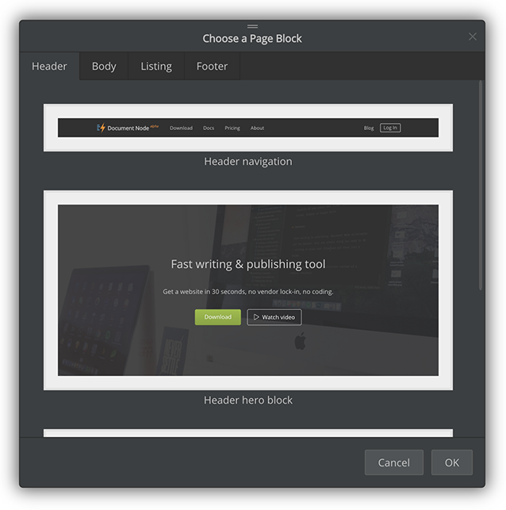
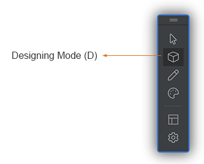
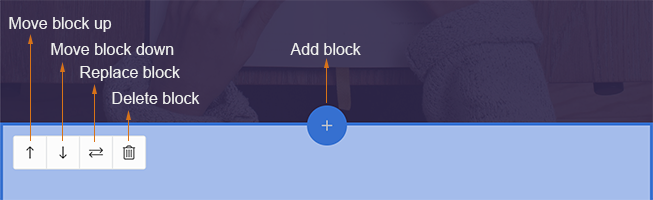
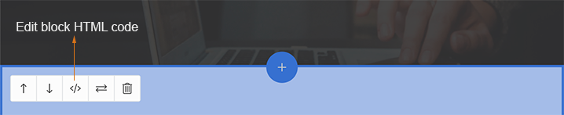
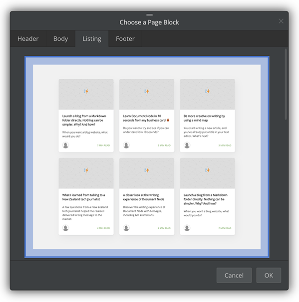
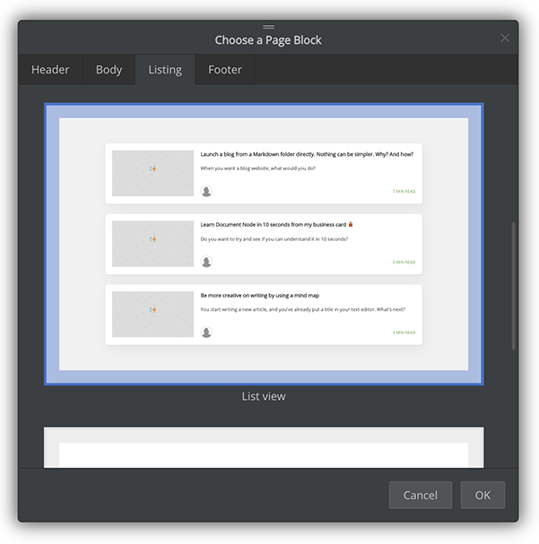
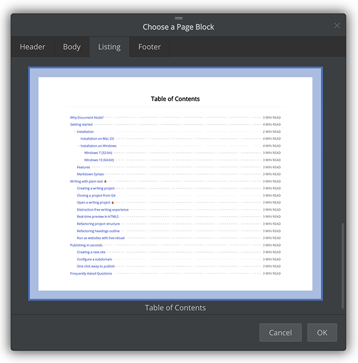
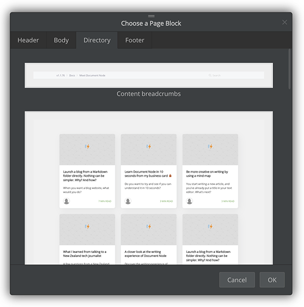
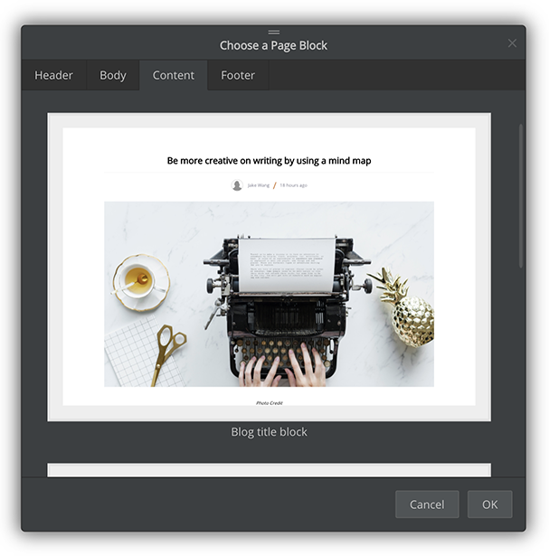

# Page blocks

Each web page is consist of multiple page blocks. Creating a new custom page becomes a simple process of choosing a few page blocks and adding them on the page.

This document lists all categories of page blocks and describes when and how to use them. All page blocks provided by Document Node are mobile-friendly and highly customisable.

Moreover, the list of page blocks is growing. Please keep your Document Node up to date so you can enjoy the latest page blocks.

## Basic operations

Enable `Designing Mode` from the site builder toolbar, then we can modify the blocks of the current page. Press the `ESC` key to go back to the `Browsing Mode`.

In `Designing Mode`, when you move your mouse over a page block, you will see a semitransparent layer with a small toolbar.

From there, you can add a new page block, move the block up or down, replace the block with a different one, or delete it.

For custom HTML blocks and some other pre-defined page blocks, we can edit the HTML code directly.

Just click the "**Code**" button on the toolbar to bring out the code editor.

## Header blocks

Page blocks in the `Header` category are suitable for the upper sections of a web page. For example, top menus and hero blocks.

## Body blocks

Page blocks in the `Body` category can be used in any kind of web pages. It contains a wide range of reusable blocks, like:
* Image block,
* Image-text block,
* Text-image block,
* Paragraph block,
* Download block,
* Pricing block,
* Team members block,
* Newsletter form block, and
* Custom HTML code block.

Our goal is providing a significant number of pre-defined, high-quality body blocks to cover most use cases.

However, if you can't find a suitable page block for your use case, you can use the `custom HTML code` block. It allows you to create any kind of new page blocks as you need. If you don't know how to code HTML/CSS, please remember that we are always here to help.

## Footer blocks

Page blocks in the `Footer` category are suitable for the footer section of a web page, where we can include company information, useful links, and so forth.

## Listing blocks

Page blocks in the `Listing` category are dynamic blocks which display all content of your website in a straightforward way, with auto-loading on scrolling feature. It works out of the box, just like most features of Document Node.

`Listing` page blocks are only available for custom pages. That is, you won't see a `Listing` tab in the page blocks chooser when you are on a content page.

Currently, three listing blocks are supported: *Cards view*, *List view*, and *Table of contents view*.

*Cards view*

*List view*

*Table of contents view*

It should be useful when you are creating a blog home page or a documentation index page.

## Directory blocks

Page blocks in the `Directory` category are similar to the `Listing` page blocks, but only list the content of the current document directory.

`Directory` page blocks are only available for directory pages. That is, you won't see a `Directory` tab in the page blocks chooser when you are on a custom page or content page.

At the moment, the following `Directory` page blocks are available:
* **Content breadcrumbs** - easy way to navigate back to the parent page
* **One-column cards view** - good for a blog index page
* **One-column list view** - good for a blog index page
* **Two-column cards view** - good for a documentation index page
* **Two-column list view** - good for a documentation index page
* **Table of contents** - good for a blog index page or a documentation index page

With the `Directory` page blocks, it will be much easier for your readers to navigate on your website.

## Content blocks

Page blocks in `Content` category are usable for all content pages. They provide beautiful visual elements to display different parts of your content, like article title, author name, creation date, cover image, article body, documentation navigation, table of contents.

`Content` page blocks are only available for content pages. That is, you won't see a `Content` tab in the page blocks chooser when you are on a custom page or directory page.

The default author name is the username of your operating system, but you can change it via [Inline editing](Inline%20editing.md). The cover image is detected from the image at the beginning of your document. If no such image exists, then no cover image will be displayed on your content page.

The following items cannot be modified directly on the web page, because they are generated from your document file automatically.
* Article title
* Article body
* Creation date
* Cover image
* Documentation navigation, and
* Table of contents

Just go back to the Document Node application window, and update them there. All changes will be synchronised into your website in milliseconds.

For now, the following `Content` page blocks are available to use:
* Content breadcrumbs
* Blog title block
* Blog article block
* Three-column documentation block

More `Content` page blocks will come. Please keep an eye on it.
