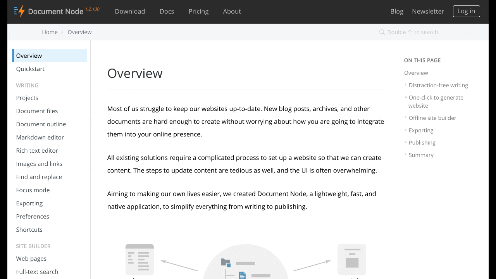

# Search on website

The websites exported from Document Node have full-text searchability built-in. It works out of the box without any configuration.

From any one of the web pages, double-tap `Shift` key, the search box will popup. Type any keywords as you like, and use `Up` or `Down` key to select a result, then press `Enter` key to open the selected result page.

Click one of the results using the mouse then you can also open the result page.

## Multiple terms

Searches for multiple terms are also supported. If a document matches at least one of the search terms, it will show in the results. The search terms are combined with OR.

    foo bar

The above example will match documents that contain either "foo" or "bar". Documents that contain both will score more highly and will be returned first.

## Wildcards

The full-text search engine supports wildcards when performing searches. A wildcard is represented as an asterisk (*) and can appear anywhere in a search term. For example, the following will match all documents with words beginning with "foo":

    foo*
    
This will match all documents that end with 'oo':

    *oo
    
Leading wildcards, as in the above example, may hurt the performance of a search, especially in large indexes.

Finally, a wildcard can be in the middle of a term. The following will match any documents that contain a term that begins with "f" and ends in "o":

    f*o
    
It is also worth noting that, when a search term contains a wildcard, no stemming is performed on the search term.

## Term boosts

In multi-term searches, a single term may be important than others. For these cases, the search engine supports term level boosts. Any document that matches a boosted term will get a higher relevance score, and appear higher up in the results. A boost is applied by appending a caret (^) and then a positive integer to a term.

    foo^10 bar

The above example weights the term "foo" 10 times higher than the term "bar". The boost value can be any positive integer, and different terms can have different boosts:

    foo^10 bar^5 baz

## Fuzzy matches

The search engine supports fuzzy matching search terms in documents, which can be helpful if the spelling of a term is unclear, or to increase the number of search results that are returned. The amount of fuzziness to allow when searching can also be controlled. Fuzziness is applied by appending a tilde (~) and then a positive integer to a term. The following search matches all documents that have a word within 1 edit distance of “foo”:

    foo~1
    
An edit distance of 1 allows words to match if either adding, removing, changing or transposing a character in the word would lead to a match. For example "boo" requires a single edit (replacing "f" with "b") and would match, but "boot" would not as it also requires an additional "t" at the end.

## Term presence

By default, the search engine combines multiple terms together in a search with a logical **OR**. That is, a search for "foo bar" will match documents that contain "foo" or contain "bar" or contain both. This behaviour is controllable at the term level, i.e. the presence of each term in matching documents can be specified. By default, each term is optional in a matching document, though a document must have at least one matching term. It is possible to specify that a term must be present in matching documents, or that it must be absent in matching documents.

To indicate that a term must be present in matching documents the term should be prefixed with a plus (+) and to indicate that a term must be absent the term should be prefixed with a minus (-). Without either prefix the term’s presence in matching documents is optional.

The below example searches for documents that must contain "foo", might contain "bar" and must not contain "baz":

    +foo bar -baz
    
To simulate a logical AND search of "foo AND bar" mark both terms as required:

    +foo +bar
