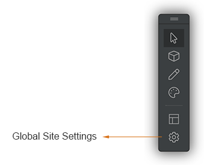
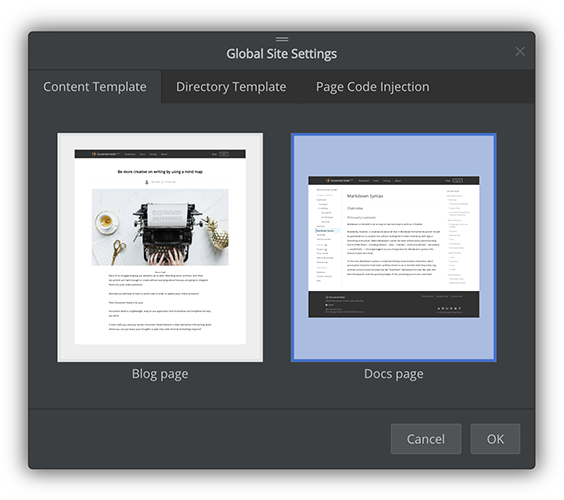
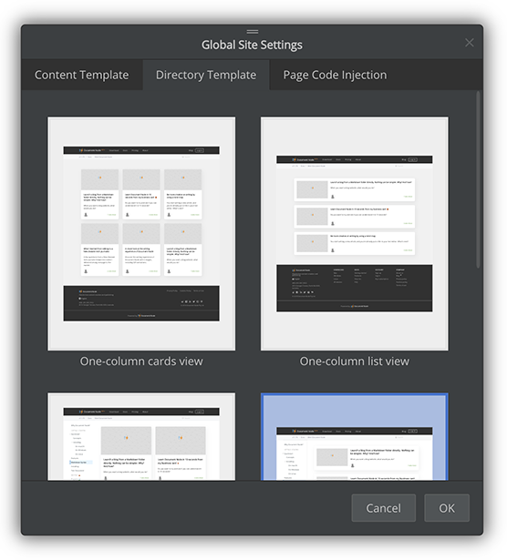
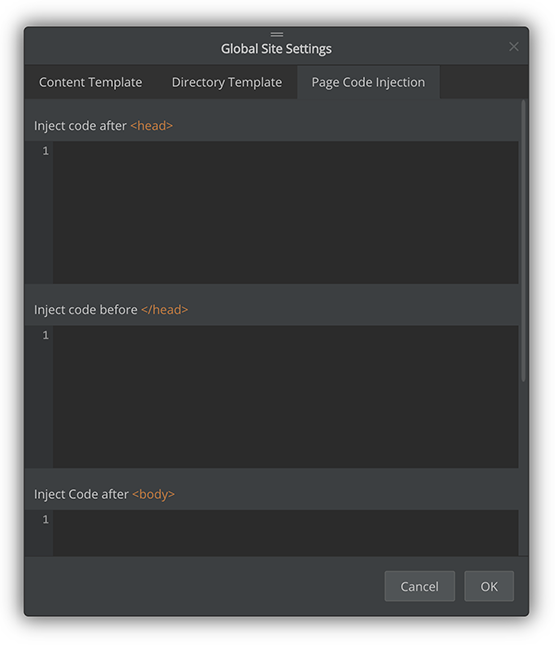

# Site settings

To change global site settings, click the "**site settings**" button from the site builder toolbar.

The `Global Site Settings` dialogue will pop up, from which we can change the global content template, global directory template, and page code injection.

## Content template

The global content template will be used by all content pages by default unless you have given a specific page template to a content page.

We can choose between a blog page layout and a documentation page layout.

## Directory template

The global directory template will be used by all directory pages by default unless you have given a specific page template to a directory page.

At the moment, we can choose from the following directory templates:
* One-column cards view
* One-column list view
* Two-column cards view
* Two-column list view
* Table of Contents tree view

## Page code injection

Page code injection allows us to insert arbitrary HTML/JavaScript/CSS code into all pages of the website. This is required when you want to incorporate third-party services or plugins into your website. For example, you may need to add Google Analytics tracking code into your web pages.

We are able to inject code in four places of every web page:
* After **&lt;head&gt;** tag
* Before **&lt;/head&gt;** tag
* After **&lt;body&gt;** tag
* Before **&lt;/body&gt;** tag

This should give you the maximum flexibility so that you can do whatever you want.
