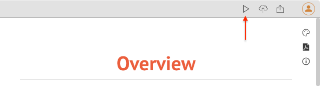
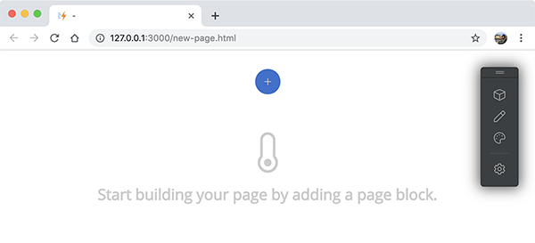

# Web pages

A typical web site contains two kinds of web pages - **content page** and **custom page**.

A **content page** usually presents a document or article to visitors, such as a blog post, a documentation page and so on. A **custom page** uses a specific layout to highlight product features, or show some structured data to visitors. For example, landing pages, pricing pages, about pages, contact pages all belong to the category of custom pages.

Document Node generates content pages out of the box from the document files of your project. Its offline site builder helps you change the page layout and create new page layouts quickly.

## Content pages

While you are writing in the text editor, if you want to see your article on a real web page, click the `Run` button from the top right toolbar.

In a couple of seconds, you will see the generated content page opened in your default web browser. If no documents are open in the editor area, the default home page of the website will be opened.

In this running mode, you will see a toolbar floating on every page of the website, which is all about the offline site builder we've mentioned.

Using this floating toolbar, you can change almost anything of a web page, such as site name, site logo, top menu items ([Inline editing](Inline%20editing.md)), page layouts ([Page blocks](Page%20blocks.md)), background colour ([Inline styling](Inline%20styling.md)), and so on.

You can drag this toolbar to wherever you want on the page.

### Content page template

When the first you run a document as a web page, the default content template will be used. Or, if you have set a global content page, then the global one will be used.

To change the current content page template, click the "**page template**" icon on the site builder toolbar.

From the "**Choose a Content Template**", you can choose the blog page layout or the three-column documentation page layout. The page template you have selected for the current page will override the global page template setting.

You can change the page layout easily by adding, changing, or deleting page blocks. For more information, please see the [Page blocks](Page%20blocks.md) page.

### Directory page template

Unlike a content page displaying the content of a document, a directory page shows the content of a document folder.

When you navigate to a directory page, you will see a default directory page template is being used. But, if you have set a global directory page, then the global one will be used.

To change the current directory page template, click the "**page template**" icon on the site builder toolbar.

From the "**Choose a Directory Template**", you can choose from a list of predefined directory templates:
* One-column cards view
* One-column list view
* Two-column cards view
* Two-column list view
* Table of Contents tree view

The directory template you have chosen here for the current directory page will override the global directory template setting.

You can change the page layout easily by adding, changing, or deleting page blocks. For more information, please see the [Page blocks](Page%20blocks.md) page.

## Custom pages

The first custom page Document Node generates for you is the index page (aka Home page). Go to the index page by typing the URL (http://127.0.0.1:3000/index.html) in your web browser.

If you are running multiple websites at the same time, you may have a different port number such as `3001`, `3002`, and so on.

### Change page layout

By using the site builder toolbar, you can customise the page layout easily by adding, changing, or deleting page blocks. For more information, please see the [Page blocks](Page%20blocks.md) page.

You can also change the page data and style, such as site name, site logo, top menu items ([Inline editing](Inline%20editing.md)), background colour ([Inline styling](Inline%20styling.md)), and so on.

### Create new pages

When you want to create a new custom page, simply type whatever the new page name is in the address bar of your web browser.

For example http://127.0.0.1:3000/new-page.html

A blank page will be opened in your web browser where you can start building an entirely new page.

Click the blue `Add` button to bring out the `Choose a Page Block` dialogue.

From which, we can choose a page block of a few kinds:

* **Header** - carefully designed page header blocks
* **Body** - carefully designed blocks for page body
* **Listing** - carefully designed blocks for listing site content
* **Footer** - carefully designed page footer blocks

All page blocks are mobile-friendly. For more information, please see the [Page blocks](Page%20blocks.md) page.

Repeat the steps to add a few more page blocks to your new custom page until it's complete. The next step is to use [Inline editing](Inline%20editing.md) and [Inline styling](Inline%20styling.md) to make everything your own.
