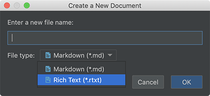
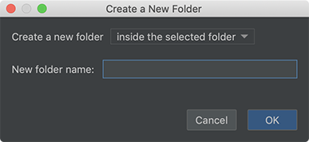
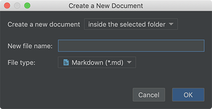
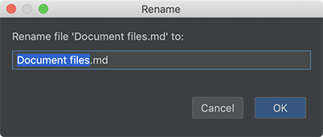
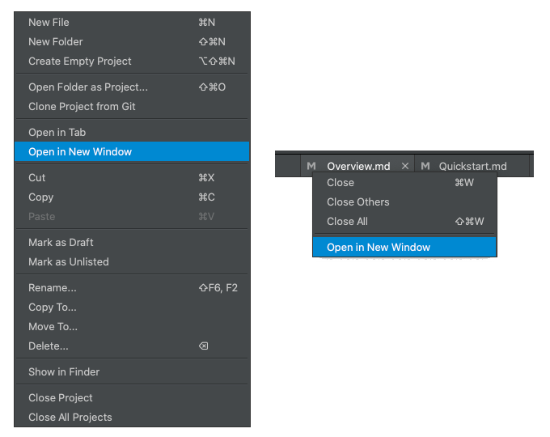

# Document files

In most cases, the purpose of writing is for someone else to read. Eliminating any steps between writing and publishing means improving productivity.

Document Node converts document files into standard readable formats automatically out of the box. It enables us to concentrate on content creation, not worrying about web server setup, site generating and so on.

## File types

For those who are familiar with Markdown, the good news is Document Node has native support for Markdown files.

While Markdown let us focus on content instead of formats, the Rich Text editor is the tradition where what you see is what you get (WYSIWYG).

Both the Markdown files (`*.md`) and Rich Text files (`*.rtxt`) can coexist in a document project. When creating a new document, you can choose the file type from the dropdown list.

No matter whether the format is Markdown or Rich Text, each document file will be converted to a content web page automatically. Depending on which page template you are using, the web page could be a blog page, a document page with a left-side navigation, or whatever page layout you like by creating one through the offline site builder.

## New folder

To create a new folder in a document project, select the application menu `File` -> `New Folder`, or from the context menu.

If we have selected a folder or document, from the "**Create a New Folder**" dialogue, we can choose a location relative to the selected item.

If the selected item is a folder, we can choose to create the new folder:
* above the selected folder,
* inside the selected folder, or
* below the selected folder.

If the selected item is a file, we can choose to create the new folder:
* above the selected file, or
* below the selected file

The order of folders and files maps to the navigation or listing on your website.

## New document

To create a new document in a document project, select the application menu `File` -> `New Document`, or from the context menu.

If we have selected a folder or document, from the "**Create a New Document**" dialogue, we can choose a location relative to the selected item.

If the selected item is a folder, we can choose to create the new document:
* above the selected folder,
* inside the selected folder, or
* below the selected folder.

If the selected item is a file, we can choose to create the new document:
* above the selected file, or
* below the selected file

The order of folders and files maps to the navigation or listing on your website.

## Document name

If you have included a title at the beginning of a document file, the title will be used as the title of the generated web page. Otherwise, the file name will be adjusted and used as the page title.

To rename a document file, right-click on the selected document and select `Rename...` from the context menu.

It's recommended that the document file names should be short and concise.

## Document sorting

As the order of folders and documents maps to the navigation or listing of the generated website directly, changing the site navigation is just a matter of dragging folders or files to a different location in Document Node.

You can drag folders or files to reorder inside the same directory or drag into a different location in another directory.

## Recent files

To open a recent document file, select the menu `File` -> `Recent Files` -> `[File Path]`.

Select `Clear Menu` to remove all the recent file items from the menu.

## Go back/forward

> `Go back/forward` is only available in version `1.4.7` or later. If you are using an old version, please upgrade to the latest one.

When working on multiple documents at the same time, we often want to go back to the previous editing locations. Going back or forward allows us to manage our writing flow easily.

There are two buttons (`Go back` and `Go forward`) on the main toolbar. By clicking these buttons we can go back/forward among the editing locations. The corresponding shortcuts are `Cmd + Alt + Left / Right` on macOS, and `Ctrl + Alt + Left / Right` on Windows and Linux.

The history of editing locations is saved on disk, which means when we restart the application, the history of editing locations is still available.

## Edit in new window

> `Edit in new window` is only available in version `1.4.7` or later. If you are using an old version, please upgrade to the latest one.

Using separate windows makes it easy to edit one document from another, or when you want to view other part of the document you are working on.

For example, when you summarize what you have written, you would definitely like to see what you have already written earlier, which is located above or below the current text cursor.

You can open as many new document windows as you like.
