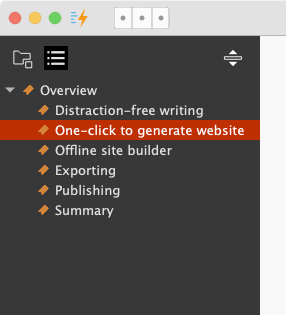
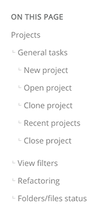

# Document outline

Usually, the headings of a document represent the logical structure of your writing. From which, readers can gain an overview of the article quickly. On the generated web page, the headings will be converted to a Table of Contents. If you export a document as a PDF file, the headings outline will end up in bookmarks.

## Outline pane

When you open the outline pane on the left side, you can see the headings tree from H1 to H6 of the current document.

Click a heading to move the text cursor to the corresponding section in the text editor.

Dragging a heading to a different location moves the whole section, including its content to the corresponding position within the document.

Document outline is supported for both the **Markdown** and **Rich Text** files.

## Web page outline

In a three-column documentation page layout, the headings are displayed as a Table of Contents in the "**ON THIS PAGE**" section on the right side.

Click each item to jump to the corresponding section on the page. You can bookmark the anchored link in your web browser if needed.
