# Exporting and sharing

Exporting your documents or projects is an essential step so that you can deliver the most appropriate format to your readers. One of the goals of Document Node is to make it extremely easy to convert your documents into different formats.

At the moment, it can convert documents into as multi-page PDF files, single-page pictures, single-page PDF files for mobile devices, HTML files with all resources embedded, and EPUB files. It can also export a writing project to a website, PDF files, HTML files, or an EPUB file at one time. More exporting formats will be developed gradually, please keep an eye on it.

## Save document as PDF

### Quick-save as PDF

If you want to save the current document as PDF, press the keyboard shortcut `Command + Shift + S` (`Ctrl + Shift + S` on Windows and Linux), and then you can save the PDF file quickly.

Or select menu `File` -> `Save as PDF`, it will do the same quick export as well.

### Save as PDF options

If the PDF files are exported for a specific screen such as tablets or mobile devices, you can open the PDF settings dialogue, by selecting `Save as PDF Settings...` from the context menu, or from the application menu `File` -> `Save as PDF Settings...`.

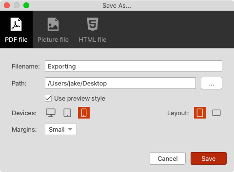

Give it a filename, choose a location on the disk, choose a target device, a layout, and set margins, you will get your PDF files exported right away. Next time when you want to do quick export, the same settings will be applied. Just press `Command + Shift + S` on macOS (`Ctrl + Shift + S` on Windows and Linux), and then press `Enter` key. It will be done within one second.

If you choose to not use the preview styles, all headings of the document will be converted to bookmarks in the generated PDF file.

### Single-page PDF for mobile

In the `Save as PDF` settings dialogue, if you select `Mobile` devices and the total number of pages is less than 20, it will be generated as a single page PDF file, which will be very good for reading on mobile devices.

## Save document as a picture

### Quick-save as a picture

If you want to save the current document as picture quickly, press the keyboard shortcut `Command + Shift + P` (`Ctrl + Shift + P` on Windows and Linux), and then you can save the picture file directly.

Or select menu `File` -> `Save as Picture`, it will do the same quick export as well.

### Save as picture options

Your document content with a beautiful preview style can be saved as a single page picture, which then can be shared with other mobiles devices.

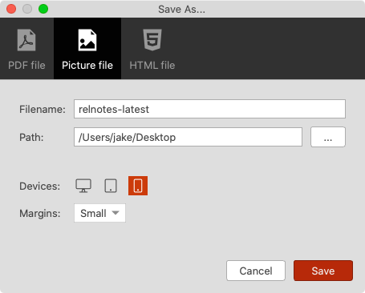

Give it a filename, choose a location on the disk, choose a target device, and set margins, you will get your single-page picture exported right away. Next time when you want to do quick export, the same settings will be applied. Just press `Command + Shift + P` on macOS (`Ctrl + Shift + P` on Windows and Linux), and then press `Enter` key. It will be done within one second.

## Save document as HTML

### Quick-save as HTML

If you want to quickly save the current document as an HTML file with all resources embedded, press the keyboard shortcut `Command + Alt + Shift + H` (`Ctrl + Alt + Shift + H` on Windows and Linux), and then you can save the HTML file directly.

Or select menu `File` -> `Save as HTML`, it will do the same quick export as well.

### Save as HTML options

Your document content with a beautiful preview style can be saved as a single HTML file without depending on any external resources, which then can be shared with others.

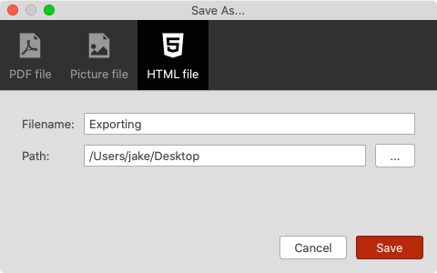

Give it a filename, choose a location on the disk, choose a target device, and set margins, you will get your single-page picture exported right away. Next time when you want to do quick export, the same settings will be applied. Just press `Command + Shift + P` on macOS (`Ctrl + Shift + P` on Windows and Linux), and then press `Enter` key. It will be done within one second.

## Save document as EPUB

### Quick-save as EPUB

If you want to quickly save the current document as an EPUB file, press the keyboard shortcut `Command + Alt + Shift + E` (`Ctrl + Alt + Shift + E` on Windows and Linux), and then you can save the EPUB file directly.

Or select menu `File` -> `Save as EPUB`, it will do the same quick export as well.

### Save as EPUB options

Fill in details of the EPUB file in the "Save Document As" dialogue.

* Filename: The EPUB file name
* Save location: The directory where the EPUB file should be saved
* Book title: The EPUB book title
* Description: The description of the EPUB book, which can be input as multiple lines
* Authors: Multiple authors are separated by line breaks; last name and first name is separated by a comma
* Cover image: Document Node can generate one for you automatically or use a custom image you provide.

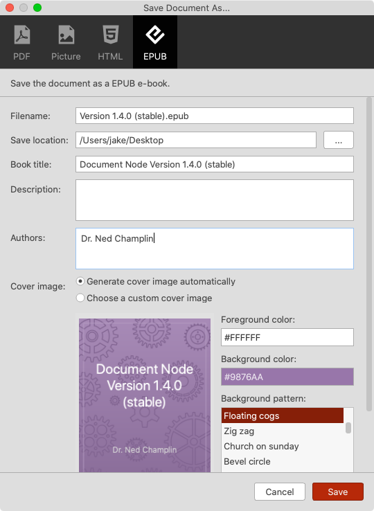

Once the EPUB file is created, you can open it using any EPUB readers on your devices.

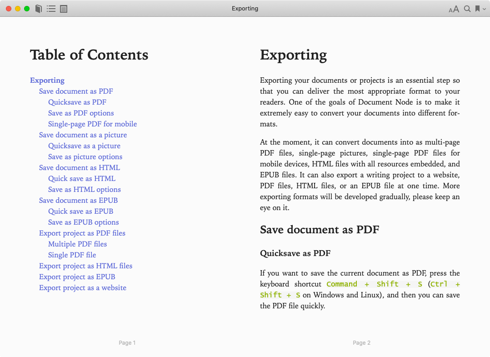

## Save document as DOCX

> `Exporting as DOCX` is available since version `1.4.5`. If you are using an old version, please upgrade to the latest one.

### Quick-save as DOCX

If you want to quickly save the current document as an DOCX file, press the keyboard shortcut `Command + Shift + D` (`Ctrl + Shift + D` on Windows and Linux), and then you can save the DOCX file directly.

Or select menu `File` -> `Save as DOCX`, it will do the same quick export as well.

### Save as DOCX options

Fill in details of the DOCX file in the "Save Document As" dialogue.

* Filename: The DOCX file name
* Save location: The directory where the DOCX file should be saved

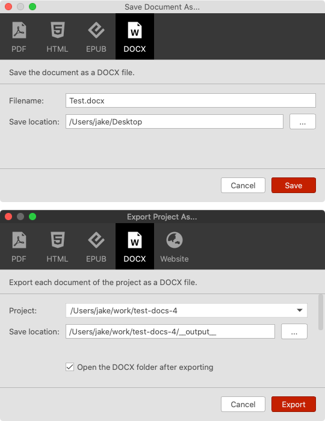

Once the DOCX file is created, you can open it using any DOCX readers on your devices.

## Shareable secret links

You can share documents quickly with others by using a shareable secret link.

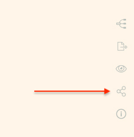

Click the "Shareable Link" icon from the top right corner of the text editor to generate a shareable secret link.

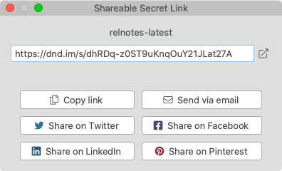

The link can be shared through multiple channels via a simply click.

## Export project as PDF files

If you want to export the current project as one or more PDF files, click the "**Export project**" icon on the top right toolbar.

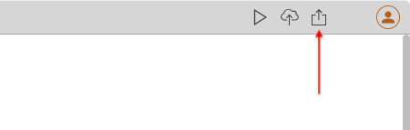

From the options dialogue, click on "**PDF files**" from the top toolbar.

### Multiple PDF files

If you want to export each document as a separate PDF file, select the "**Create a PDF per document**" radio box.

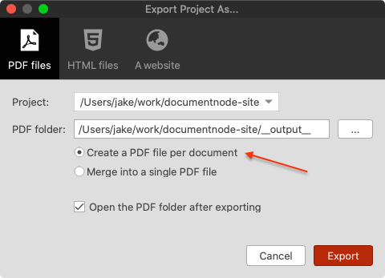

Tick the "**Open the PDF folder after exporting**" checkbox if you want to open the PDF folder after all PDF files are generated.

The headings of each document will be converted to bookmarks in the corresponding PDF file.

### Single PDF file

If you want to export the whole project as a single PDF file, select the "**Merge into a single PDF file**" radio box.

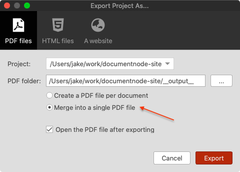

Tick the "**Open the PDF file after exporting**" checkbox if you want to open the PDF file after exporting.

The headings of all document will be converted to bookmarks in the generated PDF file.

## Export project as HTML files

If you want to export the current project as one or more PDF files, click the "**Export project**" icon on the top right toolbar.

From the options dialogue, click on "**HTML files**" from the top toolbar.

And then, choose a location where you want to save the HTML files.

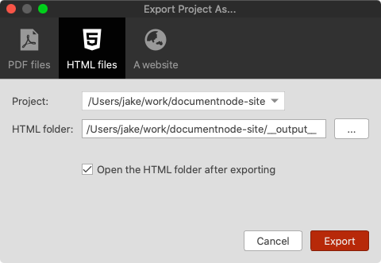

If you want to open the HTML folder after exporting, please tick the "**Open the HTML folder after exporting**" checkbox.

## Export project as EPUB

If you want to export all documents of a project as a single EPUB file, click the "**Export project**" icon on the top right toolbar, and then select the "**Epub**" tab.

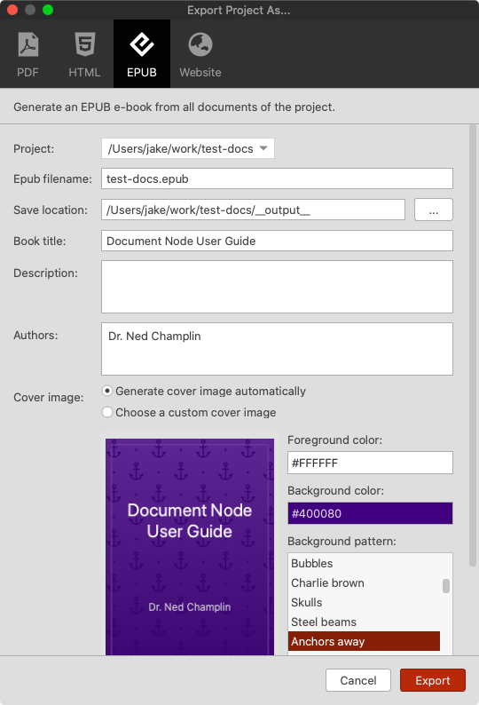

And then, fill in the details of the EPUB file.

If you want to open the EPUB file after exporting, please tick the "**Open the EPUB file after exporting**" checkbox.

## Export project as DOCX

If you want to export all documents of a project as a single EPUB file, click the "**Export project**" icon on the top right toolbar, and then select the "**Epub**" tab.

And then, fill in the details of the EPUB file.

If you want to open the EPUB file after exporting, please tick the "**Open the EPUB file after exporting**" checkbox.

## Export project as a website

If you want to export the current project as one or more PDF files, click the "**Export project**" icon on the top right toolbar.

From the options dialogue, click on "**A website**" from the top toolbar.

And then, choose a location where you want to save the website files.

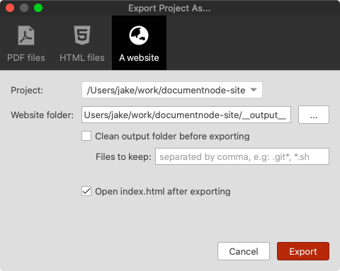

Be aware that if you have ticked the "**Clean output folder before export**" checkbox, all content inside the website folder except "**Files to keep**" specified will be deleted.

You can add folder/file names to "**Files to keep**" text box, separated by commas. Wildcards can be used.

If you want to open the "**index.html**" of your website after exporting, please tick the "**Open index.html after exporting**" checkbox.

