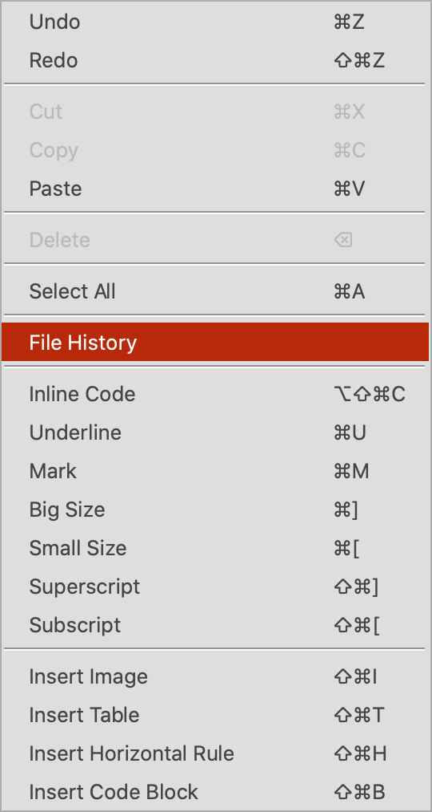
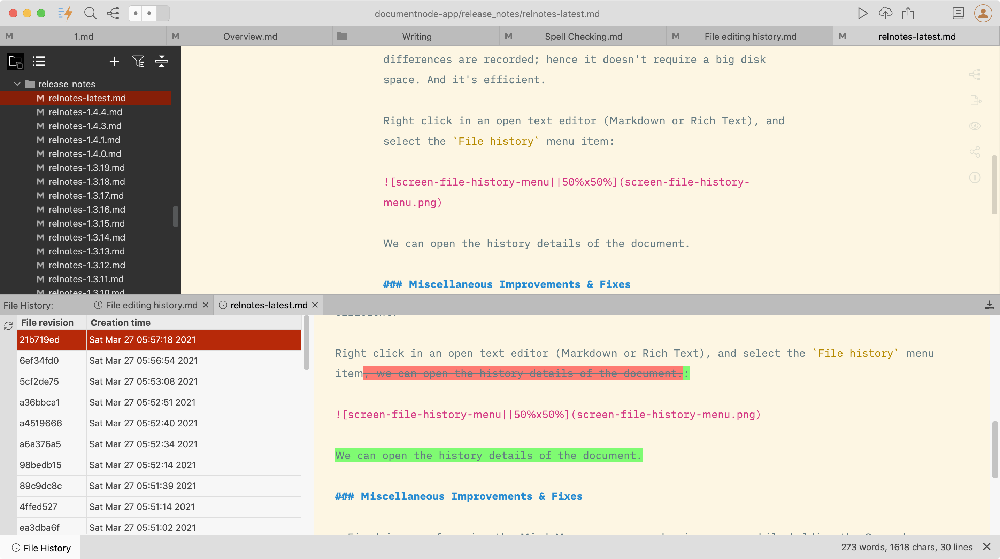

# File editing history

Have you ever tried to find an old revision of your document? It's extremely useful if we have the full editing history of documents. By navigating to different file revisions created at different times, we can explore how our thoughts have changed.

Besides, full editing history is also a great backup.

> `File history` is only available in version `1.4.5+`. If you are using an old version, please upgrade to the latest one. 

In Document Node, every document has a full editing history. Any changes in a document will be recorded for building the revision history of it. Most times, only revision differences are recorded; hence it's efficient and doesn't require big disk space.

## Open file history

It's also straightforward to use. Right-click in an open text editor (Markdown or Rich Text), and select `File history` from the context menu.

The history details of the document will be opened at the bottom panel.

The file history of multiple documents can be opened at the same time as multiple tabs.

Select a revision on the left table, the file content of the selection revision will be opened on the right-side text editor.

## Revision details

In each revision, we can see the difference between the current revision and the previous revision.

Any inserts are displayed with a green background, and deletes are displayed in strike-out format with red background.
