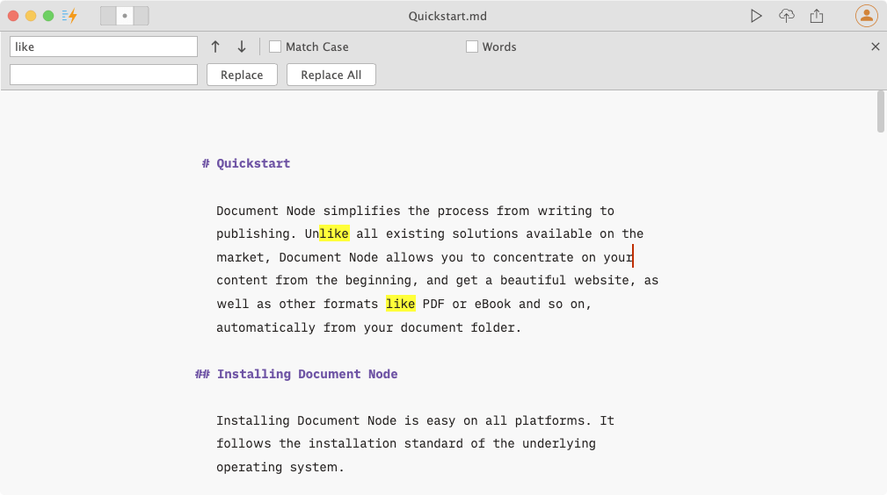

# Find and replace

#Shortcuts #Editor/Find-replace

We often need to find or replace text in a text editor. In Document Node, the "**Find/Replace**" feature is available for both the Markdown editor and Rich Text editor.

## Find

In the "**Find**" panel, we can specify whether we want to match case and to search whole words only.

After you input the keyword in the text box, press **Enter** key to go to the next occurrence. You can press the **Enter** key as many times as you want, when the cursor reaches the end of the document, it will go back to the beginning.

## Replace

In the "**Replace**" panel, we can replace the currently matched and selected text, or replace all occurrences in the whole document.

After you input the keyword in the "**Find**" text box and new text in the "**Replace**" text box, press **Enter** key to replace the current occurrence and then go to the next occurrence. You can press the **Enter** key as many times as you want until all occurrences are replaced.

## Shortcuts

All relevant shortcuts are supported on all platforms. Please see the details from the table below:

| Action/Shortcuts  | macOS | Windows | KDE Plasma | GNOME
| ------------- | ------------- | ---- | ---- | ---- |
| Find  | `Cmd+F` | `Ctrl+F` | `Ctrl+F` | `Ctrl+F` |
| Find Next  | `Cmd+G`  | `F3`, `Ctrl+G` | `F3` | `F3`, `Ctrl+G` |
| Find Previous  | `Cmd+Shift+G`  | `Shift+F3`, `Ctrl+Shift+G` | `Shift+F3` | `Shift+F3`, `Ctrl+Shift+G` |
| Replace  | `Cmd+R`  | `Ctrl+H` | `Ctrl+R` | `Ctrl+H` |
