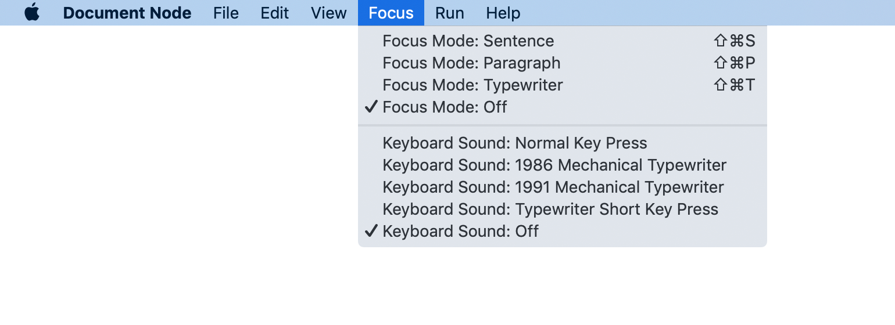
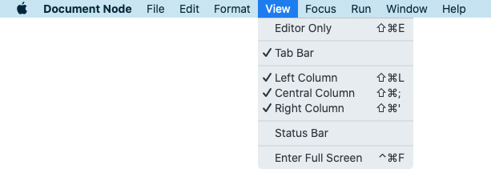

# Focus mode

Focus mode in Document Node is an experience where everything fades away. Everything but the sentence you are writing, the thought that you are expressing right now. The focus mode helps you dive into the flow.

Using focus mode in fullscreen cuts out all distractions, including whatever text surrounds your current sentence. (You can also use the modes independently). Scrolling deactivates focus mode automatically until you settle in a different spot.

In typewriter mode, writers can focus on the active typed line in the centre of the page. It places the current input line in the centre of the screen and writers can toggle on/off depending on their activity. That is an optimal ergometric feature for long sessions of writing. Without this feature, the writer is forced to stare at the bottom of the screen.

## Focus mode

From the application `Focus` menu, we can choose a focus mode as well as a keyboard sound while typing.

In focus mode, the text cursor will stay in the middle of the screen, so writers can concentrate on writing at the same place of the screen.

### Sentence

If you select "**Focus Mode: Sentence**", only the current sentence will be highlighted.

*(Focus on the current sentence)*

### Paragraph

If you select "**Focus Mode: Paragraph**", only the current paragraph will be highlighted.

*(Focus on the current paragraph)*

### Typewriter

If you select "**Focus Mode: Typewriter**", only the current line will be highlighted.

*(Focus on the current typewriter)*

## Keyboard sound

To get a quick response from keyboard typing, sometimes it's an excellent experience to turn on a keyboard sound, which makes you feel like using a mechanical typewriter.

Document Node supports four types of keyboard sounds at the moment:

* Normal key press
* 1986 mechanical typewriter
* 1991 mechanical typewriter
* Typewriter short key press

You may want to switch to different keyboard sounds and see how they sound like.

## View options

In addition to using focus mode, we could adjust the view options to hide unused UI parts while writing.

For example, use `Editor only` mode to cut off all distractions from the application UI. Together with the `Full screen` mode, only your writing is visible on your screen.

From the `View` menu, we can also show or hide:

* Editor Tab Bar
* Left Toolbar
* Right Toolbar
* Bottom Toolbar

