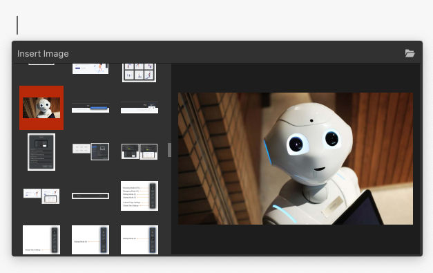

# Images and links

#Editor/Insert images# #Editor/Insert links# #Editor/Screenshots

Images perhaps are one of the most frequently used resources when it comes to writing blogs or documentation. Being able to insert pictures quickly into your document is essential in terms of productivity.

Adding links into a document is a common requirement too. For example, in a documentation site, it's helpful to link different pages together as cross-references.

Document Node provides a few ways to insert images and links into our documents quickly, which is available for both the Markdown editor and Rich Text editor.

## Project images

To insert an image into the current cursor position, select the application menu `Edit` -> `Insert Image`.


Or select `Insert Image` from the context menu.


Or, use the keyboard shortcut `Cmd+Shift+I` on macOS (`Ctrl+Shift+I` on Windows and Linux).

And then, the image popup, which lists all images within the current project, will be shown as below.



Click an image thumbnail to insert into the text editor directly. To choose an external image, click the "**Folder**" icon on the top right corner.

## Dragging from projects

Another way to add project images or links is to drag them from the left side projects tree into your text editor.

If the dragged file is an image file, an image tag will be added into the document automatically. If the dragged file is a non-image file, a hyperlink will be created instead.

## Dragging from disk

A more natural way to add external images or resource links is to drag them from the Apple Finder on macOS (or, Windows file explorer, and file manager on Linux) into your document directly.

While the images or links being added into the current document, the images (or files) you have dragged will be copied into the project automatically.

## Dragging from browser

We often need to download images from the internet and add them to our documents.

In Document Node, you don't have to download it manually. Just drag the image from your web browser into the Document Node text editor, and it's done.

For most raster images, a copy will be saved into your project automatically. For GIF and SVG images, the remote link will be used in your document.

## Copy-and-paste

If you get used to the copy-and-paste keyboard shortcuts, you will be happy to know that you can use it in Document Node for many different tasks.

Specifically, you can copy one or more files from the projects tree view and paste them into your text editor. Image files will be inserted as images, and non-image files will be added as links.

The same thing can be done from your disk. Just copy one or more files from anywhere on your hard drive, and paste them into the Document Node text editor.

## Inserting screenshots

When writing documentation or tutorials, taking screenshots and inserting into a document is a frequent task. Usually, we need to have a separate tool to take the screenshot, and then add the image into the document manually.

Document Node allows you to take a screenshot and insert into your document automatically.


When taking a screenshot, we can accurately see which pixel we are on from a small preview popup.


Once a region is selected, double-click the selected area or click the "**OK**" button to insert the screenshot picture into your document.

Before selecting a region, right-click to copy the color values of the pixel under the mouse to your clipboard. For example:

```
"#FAFAFA rgb(250,250,250)"
```

And then you can paste elsewhere.

The same function is available for the Markdown editor, and across all desktop platforms.


## Pasting screenshots

If you take a screenshot using the system keyboard shortcuts, you can also paste it into the text editor directly.

### System shortcuts on macOS

On macOS, use the shortcut `Ctrl+Cmd+Shift+4` (a portion of the screen) or `Ctrl+Cmd+Shift+3` (entire screen) to take a screenshot, and then go back to Document Node and press `Cmd+V`, you will have the screenshot inserted into the document automatically.

### System shortcuts on Windows

On Windows, press the `PrtScn` (Print Screen) key or `Ctrl + PrtScn` keys, to create a screenshot of the whole screen and save it to the clipboard. Press `Ctrl + Alt + PrtScn` to take screenshots of the active window and save to the clipboard.

If you are using Windows 10, press `Windows + Shift + S` to capture a region of your screen and copy it to your clipboard.

After that, go back to Document Node and press `Ctrl + V` to paste the screenshot captured into the document.

### System shortcuts on Linux

On Ubuntu, press `Ctrl + PrtScn` to take a screenshot of the desktop and save to the clipboard. Press `Ctrl + Alt + PrtScn` to take a screenshot of a window and save to the clipboard. Press `Ctrl + Shift + PrtScn` to take a screenshot of an area you select and save to the clipboard.

After that, go back to Document Node and press `Ctrl + V` to paste the screenshot captured into the document.

It should be similar for other Linux distributions. Please check the documentation of your Linux operating system to find out the specific shortcuts.

## Extended Image Syntax

In the Markdown editor, Document Node supports an extended image syntax, by which you can set image description, alignment, and size.

Here is an example of the extended image syntax:

```Markdown

```

If the image description starts with `@`, it means showing the description under the image. Separated by `|`, we can specify the image alignment and size too. However, you don't have to type all these manually. When you move your text cursor into an image block, there will be a `Settings` button shown.


Click the **Settings** button, you will be able to manage the image settings in a dialogue.


## Update links when moving documents

Imagine you have a Markdown (or RichText) document, which has a few local images inserted. If you move the document file to a different folder, you may find that the pictures cannot be displayed correctly in the preview area any more. That's because the relative image paths haven't been updated in your document.

In this version, we improved the software to update all the resource links automatically when you move documents to a different folder or project. If you are moving or copying documents to a different project, you will be asked whether you want to copy the images and files associated with the documents.


Just one less thing to worry about by Document Node users.