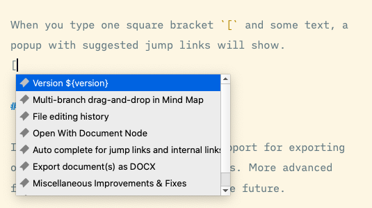
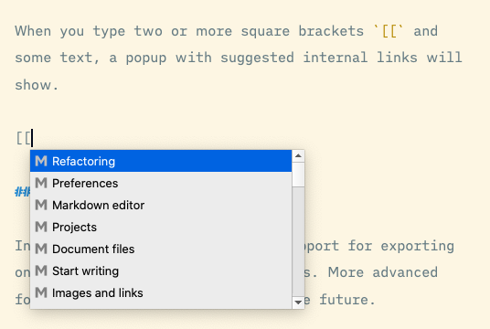

# Links auto-complete

Interconnection of knowledge within a document and between multiple documents is a key to efficiently building a knowledge base or other writing projects.

Document Node supports **jump links** and **internal links** very well. We will continue polishing and adding more powerful tools around the interconnection of knowledge.

> `Links auto-complete is only available in version `1.4.5+`. If you are using an old version, please upgrade to the latest one. 

## What are they

**Jump links** are links that jump between sections within the same document. Each section starts with a heading which could be one of H1 to H6.

**Internal links** point to other documents in the same writing project. Internal links indicate the relationship amongst documents and provide an easy way to navigate the writing project.

## Auto-complete

When you type one square bracket `[` and some text, a popup with suggested jump links will show.

When you type two or more square brackets `[[` and some text, a popup with suggested internal links will show.

Select a link and press `Enter`, the link will be inserted into your Markdown editor automatically.

## All links are clickable

All links, including jump links and internal links, are clickable in the Markdown editor and on the preview page.

In the Markdown editor, when you hold the `Command` key (`Ctrl` key on Windows and Linux) and click a **jump link**, the text cursor will jump to the corresponding section of the current document. 

Similarly, when you hold the `Command` key (`Ctrl` key on Windows and Linux) and click an **internal link**, the linked document will be opened in the editor.

All links, including jump links and internal links, are also clickable on the preview page.

**External links** will be opened by the default application on your machine. For example, external web URLs will be opened in your default web browser, and file URLs will be opened by associated applications.
