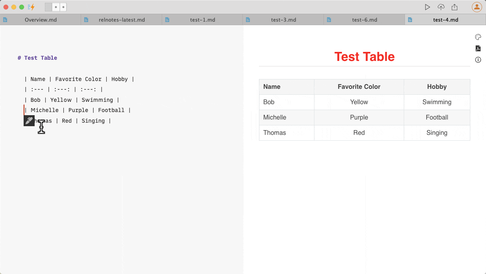
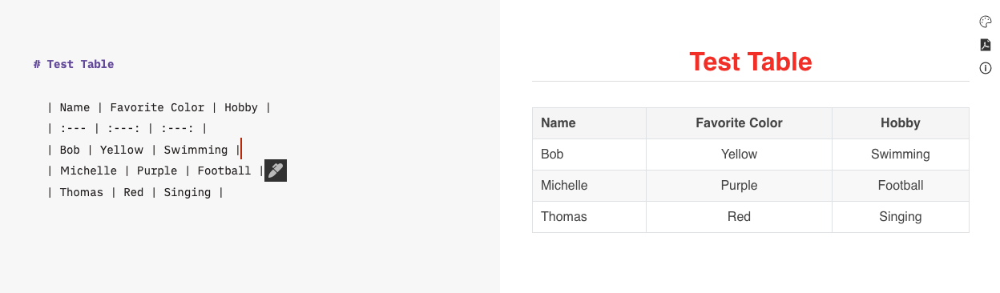
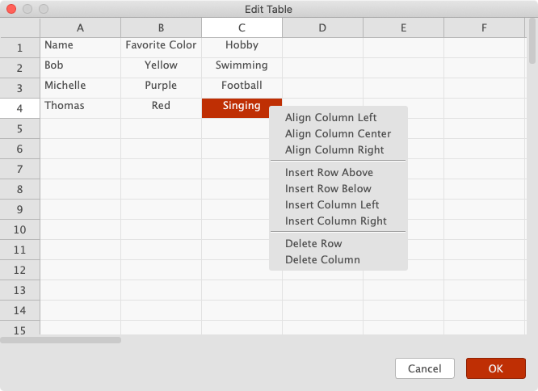
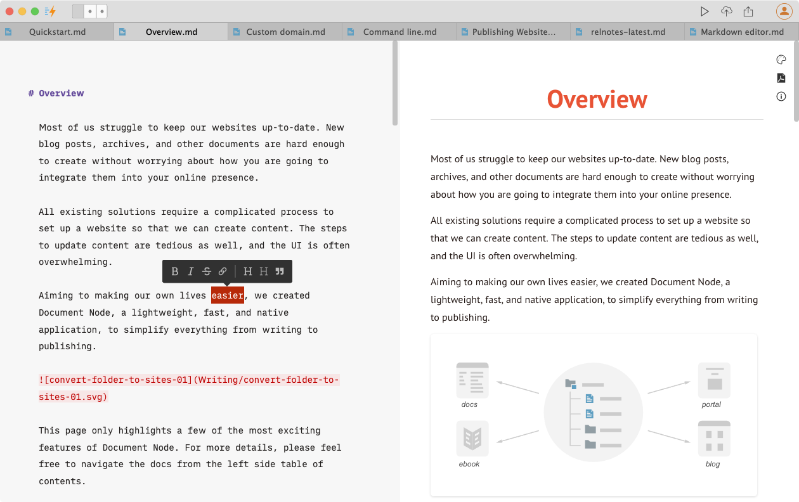
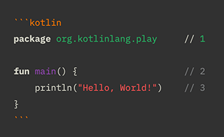

# Markdown editor

## What is Markdown?

It's a plain text format for writing structured documents, based on formatting conventions from email and Usenet.

Markdown is a way to style text on the web. You control the display of the document; formatting words as bold or italic, adding images, and creating lists are just a few of the things we can do with Markdown. Mostly, Markdown is only regular text with a few non-alphabetic characters thrown in, like `#` or `*`.

Want to [learn Markdown in 60 seconds](https://commonmark.org/help/)?

### CommonMark

[CommonMark](https://commonmark.org/) proposes a standard, unambiguous syntax specification for Markdown, along with a suite of comprehensive tests to validate Markdown implementations against the specification.

### Github Flavored Markdown

GitHub.com uses a version of the Markdown syntax that provides an additional set of useful features:

* Tables
* Task list items
* Strikethrough texts
* Extended auto-links

Document Node supports the core features of CommonMark as well as the extended Github Flavored Markdown. With auto-suggestion and syntax highlighting, writing using Document Node is definitely a joy.

## Table Editing

The intention of Markdown is to minimize the formatting burden while writing and keep the content as plaintext for easy to read and share. But, when it comes to tables, things are a bit embarrassing.

In nature, tables are structured into rows and columns and heavily depend on the format to visually present the data. It's hard to manage in plain text. Perhaps that's the reason why the core [CommonMark specification](https://spec.commonmark.org/current/) doesn't include tables at all.

The [GitHub Flavored Markdown](https://github.github.com/gfm/) introduced the Tables extension, but you will find it still hard to write a complex table merely in plaintext.

If we just want to modify some text of a Markdown table slightly, it's not too hard. It's painful to create a big table and add or delete rows and columns in Markdown.

To solve this problem while keeping the convenience of Markdown plaintext, Document Node introduced an Excel-like user interface, where we can edit tables flexibly.

When we move our text cursor into a Markdown table, an `Edit` icon will appear below.

]

Click the `Edit` icon, the table under cursor will be loaded into a spreadsheet dialogue.

On this spreadsheet dialogue, we can adjust column alignments, insert rows and columns, or delete rows and columns.

Once we have finished editing the table, click the "OK" button, the latest Markdown table will be generated automatically and updated in the text editor. Any empty cells around the data table will be trimmed.

With this functionality in place, writing tables in Markdown becomes a real pleasure. 

## Side-by-side preview

When you open the "Preview" pane on the right side, you can see what your Markdown content looks like in a basic HTML format.

Changes will be synchronized to the preview pane automatically. Scrolling in the Markdown editor will scroll on the preview pane at the same time.

Clicking the PDF icon on the header of the preview pane, we can quickly export the current document as a PDF file.

## Synchronizing scroll bar

While you are writing at the bottom of your text editor in Document Node, you often want to switch to your web browser and see the current sentence on the page. 

With the feature of synchronizing the scroll bar position between the text editor and the web page, we don't have to scroll to bottom any more manually.

The same feature is available in the [Rich text editor](Rich%20text%20editor.md) as well.

## Syntax highlight

In addition to highlighting basic Markdown syntax, the Markdown editor can highlight source-code fragments as well. With a generic syntax highlighting engine, Document Node supports the highlighting of 310 languages.

Code blocks highlighting happens in four and more places:

* The Markdown editor
* The preview pane
* The web page generated
* The PDF files exported

That is, without any other plugins or configurations, by only using Document Node, you will get all your code syntax-highlighted in all places, as well as your website, blog, or online documentation.

When you start typing the code block language, there will be auto-complete available. As references, please see below for a complete list of supported languages.

> 4dos, abap, abc, actionscript, ada, adblock, agda, ahdl, ahk, alert, ample, ansforth94, ansic89, ansys, apache, apparmor, asciidoc, asm-avr, asm-dsp56k, asm-m68k, asm6502, asn1, asp, awk, bash, bibtex, bitbake, bmethod, boo, brightscript, c, carto-css, ccss, cg, cgis, changelog, chicken, cil, cisco, clipper, clist, clojure, cmake, coffee, coldfusion, commonlisp, component-pascal, context, cpp, crk, cs, css, cubescript, cue, curry, d, debianchangelog, debiancontrol, desktop, diff, djangotemplate, dockerfile, dosbat, dot, doxyfile, doxygen, doxygenlua, dtd, e, eiffel, elixir, elm, email, erlang, euphoria, fasm, fastq, ferite, fgl-4gl, fgl-per, fish, flatbuffers, fortran, freebasic, fsharp, fstab, ftl, gap, gcc, gcode, gdb, gdb-bt, gdbinit, gdl, gettext, git-ignore, git-rebase, gitolite, glosstex, glsl, gnuassembler, gnuplot, go, grammar, groovy, haml, hamlet, haskell, haxe, html, hunspell-aff, hunspell-dat, hunspell-dic, hunspell-idx, idconsole, idl, ilerpg, inform, ini, intelhex, isocpp, j, jam, java, javadoc, javascript, javascript-react, jcl, jira, json, jsp, julia, k, kbasic, kconfig, kdesrc-buildrc, kotlin, latex, ld, ldif, less, lex, lilypond, literate-curry, literate-haskell, logcat, logtalk, lpc, lsl, lua, m3u, m4, mab, magma, makefile, mako, mandoc, markdown, mason, mathematica, matlab, maxima, mediawiki, mel, mergetagtext, meson, metafont, metamath, mib, mips, modelica, modelines, modula-2, modula-2-iso-only, modula-2-pim-only, modula-2-r10-only, monobasic, mup, mustache, nagios, nasm, nemerle, nesc, ninja, noweb, nsis, objectivec, objectivecpp, ocaml, ocamllex, ocamlyacc, octave, oors, opal, opencl, openscad, pango, pascal, perl, pgn, php, picsrc, pig, pike, pli, ply, pony, postscript, povray, powershell, ppd, praat, progress, prolog, protobuf, pug, puppet, purebasic, python, q, qdocconf, qmake, qml, r, rapidq, rdoc, relaxng, relaxngcompact, replicode, rest, rexx, rhtml, rib, rmarkdown, roff, rpmspec, rsiidl, rtf, ruby, rust, sather, scala, scheme, sci, scss, sed, selinux, selinux-cil, selinux-fc, sgml, sieve, sisu, smali, sml, spice, sql, sql-mysql, sql-oracle, sql-postgresql, stan, stata, stl, systemc, systemverilog, tads3, taskjuggler, tcl, tcsh, template-toolkit, texinfo, textile, tibasic, tiger, toml, txt2tags, typescript, typescript-react, uscript, vala, valgrind-suppression, varnish, varnish4, varnishcc, varnishcc4, varnishtest, varnishtest4, vcard, velocity, vera, verilog, vhdl, vrml, wavefront-obj, wayland-trace, winehq, wml, xharbour, xml, xmldebug, xonotic-console, xorg, xslt, xul, yacas, yacc, yaml, yang, zonnon, zsh

## Markdown Editor Theme

Document Node provides a few built-in Markdown themes for both the dark mode and light mode.

The background of the Markdown editor and other text colors can also be fully customized in [Preferences](Preferences.md).
