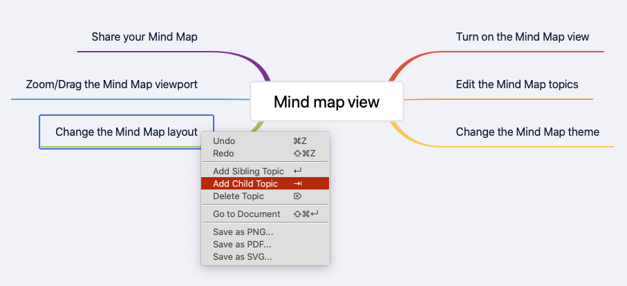

# Mind map view

#Mind map# #Restructuring #Markdown #Rich Text# #Preferences/Custom theme# #Shareable link#

A mind map represents ideas and concepts in a simple graphical way that resembles much more closely how your brain works. It maps your mind.

It helps you structure information, better analyze and generate new ideas. Mind mapping avoids linear thinking and boosts your creativity. Best of all, it's straightforward and fun!

Document Node has the full support of Mind Map for both the **Markdown** and **Rich Text** documents. Essentially, the skeleton of an article is a mind map already, we just need to present it properly, and modify as needed.

## Turn on the Mind Map view

Whenever you want to see the mind map view of your article, click the Mind Map toggle button on the toolbar to turn it on. Or, move your mouse over the top area of the text editor, and you will see a Mind Map icon, then click the Mind Map icon to turn on the mind map view.

Now, you can view or refine your article structure in the mind map.

If you get used to keyboard shortcuts, you can use the `Cmd+Shift+Return` (`Ctrl+Shift+Return` on Windows and Linux) hotkey to quickly switch between the **Mind Map view** and **Document view**.

## Arbitrary Levels

Both the headings and bullet list items will be treated as Mind Map nodes, which enables us to have arbitrary levels of nodes in a Mind Map.

Of course, you can choose to only use headings or bullet list items in your document as a way to create Mind Map in an open format.

## Edit the Mind Map topics

Keyboards shortcuts are ready to serve you at any moment. Press the "**Tab**" key to create a new child topic, pressing the "**Enter**" key to create a new sibling topic, and press the "**Delete**" key to delete the currently selected node.

Use arrow keys (Left, Right, Up, and Down) to navigate between Mind Map nodes.

Please note that, when you delete a topic from the Mind Map view, the content of the section and all children topics will be removed from the document as well.

"**Undo/Redo**" is available and can be triggered via the context menu or keyboard shortcuts (`Cmd+Z` and `Cmd+Shift+Z` on macOS, or `Ctrl+Z` and `Ctrl+Shift+Z` on Windows and Linux).

All the actions are available in the context menu as well.

Select a Mind Map topic first, and then right-click on it to show the context menu.

## Reorder Mind Map via Drag-and-drop

We can drag and drop nodes around using our mouse in a Mind Map.

It becomes so easy to change the structure of a document, no matter whether it's a Markdown or Rich Text file because both formats can have a beautiful Mind Map view.

## Document Editor Popup in Mind Map

We are also able to edit the corresponding document section of a Mind Map node.

When we click the "**Edit**" icon of a Mind Map node, a document editor popup will be shown, and the document section is presented to you for editing.

If we click anywhere in the Mind Map view, the document editor popup will disappear automatically.

As we know, both the Markdown files and Rich Text documents can have Mind Map views, which means if the current document is a Markdown, the document editor popup will be a fully functional Markdown editor. Or, a Rich Text editor will be included in the document editor popup.

## Change the Mind Map theme

From the toolbar, we can quickly change the Mind Map theme for a document from the 15 built-in themes. Each document can have a different theme.

## Mind Map Theme Customization

We believe that when we concentrate on the content, we shouldn't care about the styles and themes. Unlike most of the Mind Map software, themes can be managed separately in Document Node, instead of allowing users to change style properties of each node.

It's never been easier to create a new Mind Map theme in Document Node. We just need to change a few properties in a small JSON file.

## Change the Mind Map layout

Click the "Layout" button on the toolbar, we can quickly change the Mind Map layout for a document. Every document can have a different layout.

## Collapse and Expand Nodes

> `Collapsing and Expanding Node` is only available in version `1.3.16+`. If you are using an old version, please upgrade to the latest one.

With a collapsible tree structure, Mind Maps provided by Document Node can be so much more than just a writing tool. They could be a great presentation tool too.

With the ability to collapse the sibling and child topics, you can guide the audience through your thought process. Slowly revealing the Mind Map builds excitement while also leaving a trail of breadcrumbs to remind attendees how the process evolved and what conclusions were drawn. The presenter can also quickly enter audience comments, and other people get the enjoyment of seeing their ideas absorbed into a growing tree.

Except for the central topic, all children of the main topics and subtopics can be collapsed and expanded as needed.

The collapsible states of each document are remembered, even when we restart the application.

It's also quick and easy to collapse or expand all Mind Map nodes from the two newly added toolbar buttons, as shown in the screenshot above.

## Zoom/Drag the Mind Map viewport

From the toolbar, we can zoom in or zoom out the Mind Map viewport. When choosing the "Hand" toolbar icon, we can drag the Mind Map canvas around, which is helpful when there are many topics that cannot be fit in the viewport.

Hold on the "**Space**" key then you can drag the Mind Map canvas around. Release the "**Space**" key, it will go back to the normal selection mode.

## Export Your Mind Map

Click the "Share" button on the toolbar, or select sharing options from the context menu, we can export the Mind Map into different formats.

At the moment, the following formats are supported:

* PNG
* PDF
* SVG

More formats and sharable URLs will be supported shortly.

## Shareable Secret Links

Click the "Shareable Link" icon on the Mind Map toolbar, we can get a secret link so that you can share your Mind Map to others.
