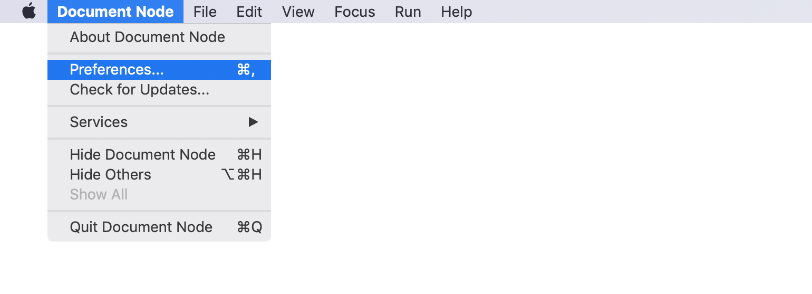
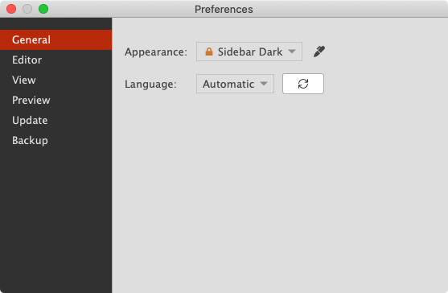
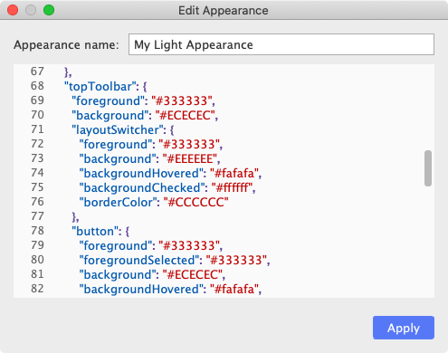
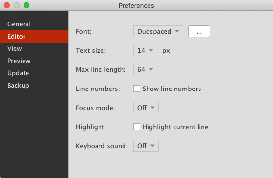
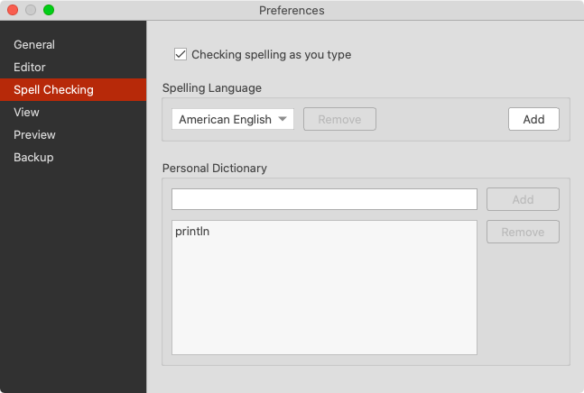
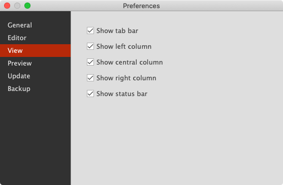
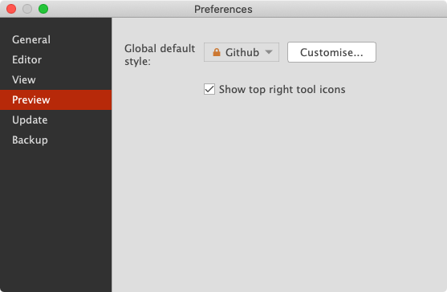
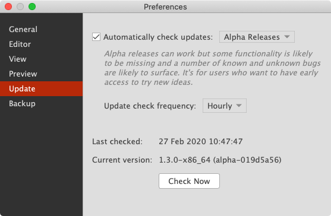
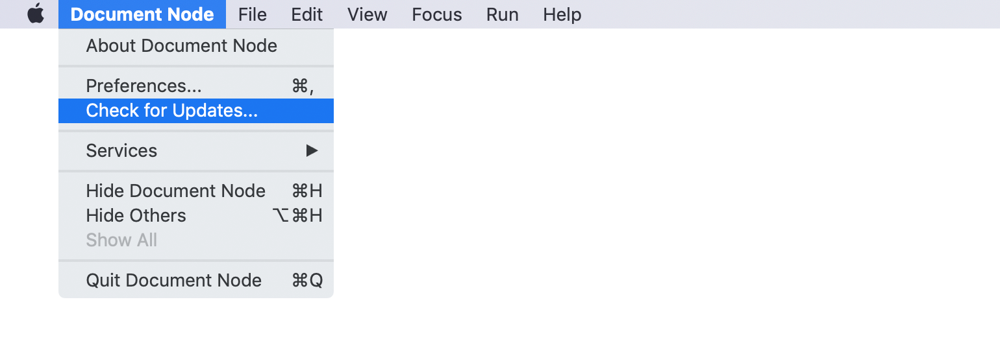
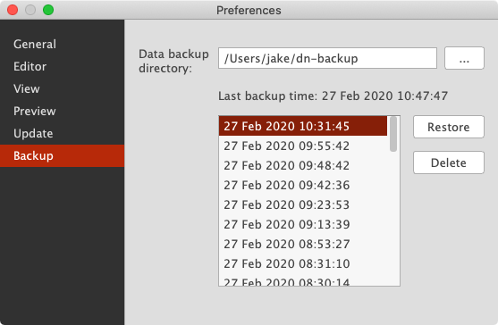

# Preferences

We can customize Document Node by changing the preferences, which will be remembered even if we restart the application.

To open the "**Preferences**" dialog, select the menu `Document Node` -> `Preferences...` on macOS.

The same dialog is available on Windows and Linux, via the menu `Tools` -> `Options...`.

## General

On the `General` page of the `Preferences` dialog, we can change the theme and language of the application.

### Customizable Appearance

From this version, it becomes so easy to create your own appearance, as long as you know how to edit simple JSON properties.

When you click "Apply", the application GUI will be updated immediately, so you can preview your changes in real-time.

Document Node provides three built-in appearances:
* Dark
* Light
* Sidebar Dark

On macOS, there is another `Automatic` option, which will follow the system Dark/Light mode. When you change your system to Dark mode or light mode, Document Node will be adjusted to Dark or Light appearance automatically.

### Language

The following languages are supported in Document Node:

* English
* Danish
* German (via Google Translate)
* Korean (via Google Translate)
* Japanese (via Google Translate)
* French (via Google Translate)
* Russian (via Google Translate)
* Hindi (via Google Translate)
* Spanish (via Google Translate)
* Arabic (via Google Translate)
* Malay (via Google Translate)
* Bengali (via Google Translate)
* Simplified Chinese
* Traditional Chinese
* Portuguese (via Google Translate)
* Italian (via Google Translate)
* Dutch (via Google Translate)

If you spot any translation issues, please let us know, and we will fix them immediately.

## Editor

On the `Editor` page of the `Preferences` dialog, we can change the settings of text editors.

Choose a recommended font from the dropdown list, or you can choose a system font by clicking the "..." button.

Other text editor settings include:

* **Text size** - the default font size of text editors
* **Line length** - the maximum number of characters allowed per line
* **Line numbers** - whether we want to show line numbers or not
* **Font mode** - choose a focus mode from the dropdown list: 
  * *Sentence*, 
  * *Paragraph*, 
  * *Typewriter*, 
  * or *Off*.
* **Highlight** - whether we want to highlight the current line or not
* **Keyboard sound** - choose a keyboard sound from the dropdown list: 
  * *Normal key press*, 
  * *1986 mechanical typewriter*, 
  * *1991 mechanical typewriter*, 
  * *Typewriter short key press*,
  * or *Off*.

## Spell Checking
> `Spell Checking` is only available in version `1.4.1+`. If you are using an old version, please upgrade to the latest one.

On the `Spell Checking` page of the `Preferences` dialog, we can configure the behaviors of spell checking, set the default spelling language, and maintain a personal dictionary.

For more information, please see the [Spell Checking](Spell%20Checking.md) page.

## View

On the `View` page of the `Preferences` dialog, we can show or hide the editor tab bar, left toolbar, right toolbar, or the bottom toolbar.

## Preview

On the `Preview` page of the `Preferences` dialog, we can specify the global default preview style, and choose to show or hide the top right tool icons on the preview page.

## Update

On the `Update` page of the `Preferences` dialog, we can enable or disable the automatic updates checking. The auto-update is enabled by default, and it's recommended to leave it enabled because we are fixing bugs and adding new features frequently.

### Alpha channel

Alpha releases can work, but some functionality is likely to be missing, and some known and unknown bugs are likely to surface. It's for users who want to have early access to try new ideas.

The alpha channel includes all **alpha releases**, **beta release**, and **stable releases**.

### Beta channel

Beta releases have had all of the major known issues fixed but have not been tested enough for official releases. It's for public previews and collecting the second-round of feedback.

The beta channel includes all **beta releases** and **stable releases**.

### Stable channel

Stable releases have gone through a rigorous quality assurance process and that all major technical issues have been identified and resolved. It is ready to be released to the general public.

The stable channel only includes **stable releases**.

### Check frequency

You can specify the check frequency from the following list of values:

* Hourly
* Daily
* Weekly
* Monthly

It's recommended to set it to `Hourly` so that the latest fixes can be applied as soon as possible.

### Check now

To check updates manually, click the `Check Now` button on the `Update` page of the `Preferences` dialog.

Alternatively, you can select the menu `Document Node` -> `Check for Updates...` on macOS.

Or, select the menu `Help` -> `Check for Updates...` on Windows and Linux.

## Backup

User preferences, custom appearance, and custom preview styles will be backed up automatically, to avoid any possibilities of data loss.

By default, the backup folder is created in your home directory. You can change it to a different location if you like.

