# Projects

As we have mentioned in the [Quickstart](../Quickstart.md) guide, a project is simply a folder which contains documents and relevant resources, such as icons, images, and whatever files needed in a website.

This page lists the details of how to manage projects in Document Node, which should be straightforward.

## General tasks

When the first time you open Document Node, you will see a Welcome page, where you can create a new document directly. 

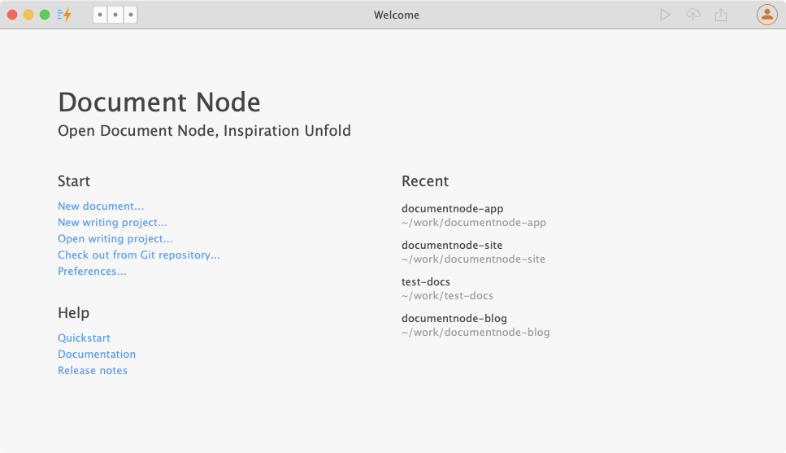

If you don't specify a project folder, the default one `~/My Writings` will be used.

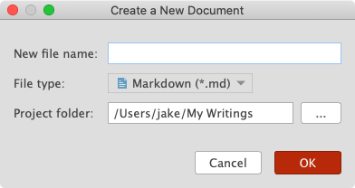

As you can see from the dialogue above, we can also choose a different file type, but more about that will be on the [Document files](Document%20files.md) page.

### Create empty project

To create a new project, please select menu `File` -> `New Project`, or use the keyboard shortcut `Cmd+Alt+N` on macOS (`Ctrl+Alt+N` on Windows and Linux).

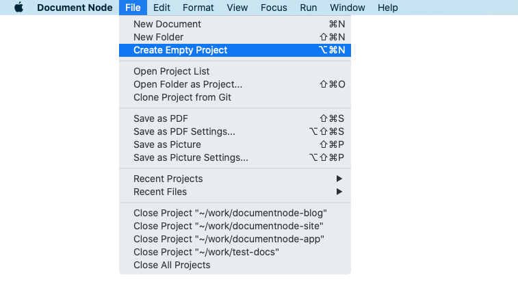

The "New Writing Project" dialogue will open then you can specify a name and location for your new project.

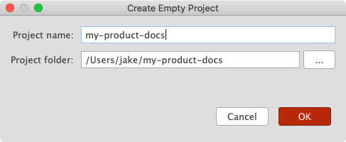

The project folder is the place where all relevant documents will be put into. While you are typing the project name, the project folder will be determined automatically, and by default, it's located in your home folder. If you wish, you can choose a different location. A new project folder will be created on your disk.

### Open project

Any document folders on your disk can be opened as projects in Document Node. To open a project folder, select menu `File` -> `Open Project`, or use the keyboard shortcut `Cmd+Shift+O` on macOS (`Ctrl+Shift+O` on Windows and Linux).

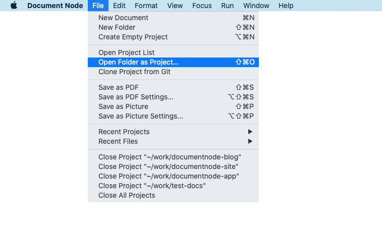

Once a project is opened, you can navigate from the left side projects view and open documents to edit. Multiple projects can be opened in the same Document Node application window so we can work on documents from different projects simultaneously.

### Clone project from Git

If your document project is in a remote Git repository, you can clone it directly within Document Node.

To clone a project from a remote Git repository, select the menu `File` -> `Clone Project from Git`.

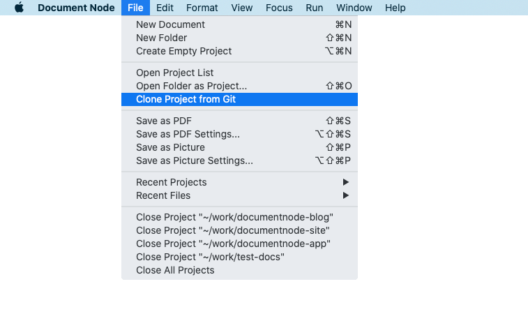

In the **Check out from Git repository** dialogue, specify a **Git URL** and a **Directory**, and click **OK** to start cloning the project.

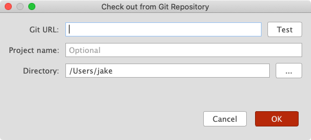

Optionally, you can click the **Test** button to check whether the Git URL is valid or not.

### Recent projects

To open a recent project, select the menu `File` -> `Recent Projects` -> `[Project Path]`.

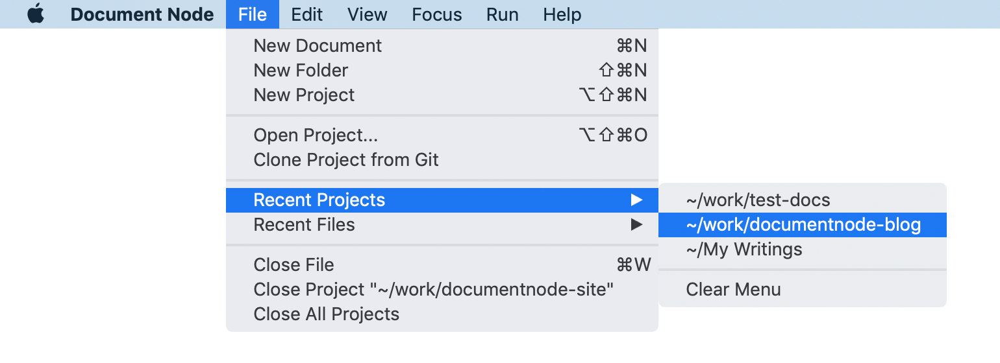

Select `Clear Menu` to remove all the recent project items from the menu.

### Close project

To close a project, select the menu `File` -> `Close Project "[Project Path]"`.

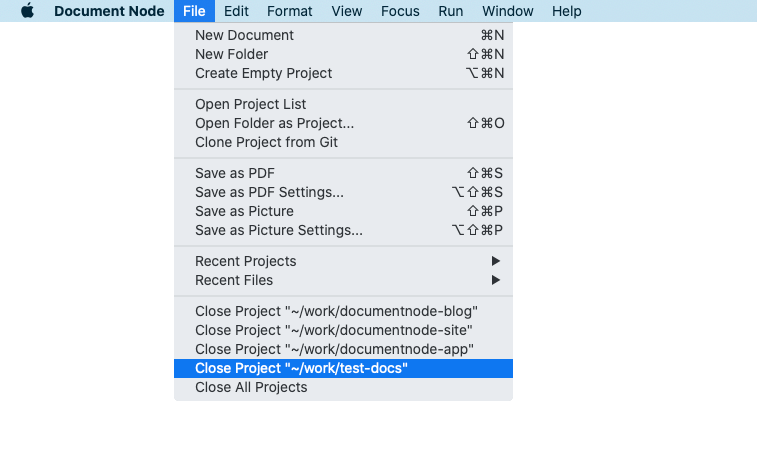

Alternatively, right-click on the project, and select `Close Project` from the context menu.

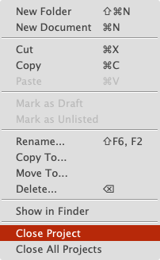

Similarly, select `Close All Projects` to close all projects, and it will bring out the Welcome page, where we can start again.

## View filters

When image files (or other resource files) are listed together with document files in the projects tree, it's sometimes annoying, because most times we only care about document files.

Using the filter options allows us to only show a specific type of files in the projects tree.

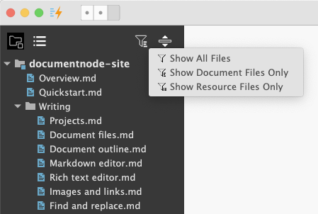

When clicking on the project title, we can choose what to show in a dropdown popup:

* All files
* Document files (the default state)
* Resources files (show non-document files only)

We can also use the filter icon to toggle between "**Document files**" and "**All files**".

## Refactoring

One of the most powerful features of Document Node is the direct mapping between the documents folder structure and the website structure. For example, you don't have to configure the navigation menu of your documentation site manually, because it can be generated from your folder structure automatically.

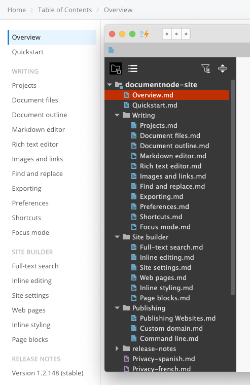

Document Node also provides straightforward ways for restructuring the folders and files in a writing project.

Using the basic `Cut/Copy/Paste/Delete` operations, you can easily move documents around, copy them to a different location, or delete them.

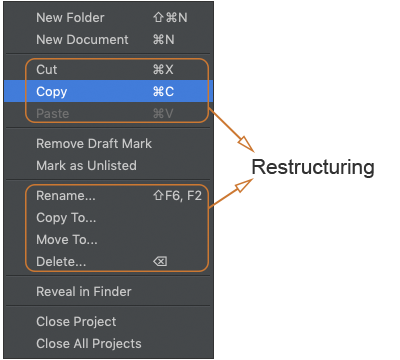

Standard shortcuts are available as below:
| Action | Shortcut on macOS | Shortcut on Windows/Linux |
| ---- | ---- | ---- |
| Cut | `Cmd+X` | `Ctrl+X` |
| Copy | `Cmd+C` | `Ctrl+C` |
| Paste | `Cmd+V` | `Ctrl+V` |
| Rename | `Shift+F6`, `F2` | `Shift+F6`, `F2` |
| Delete | `Delete` | `Backspace` |

An easier way to refactor your document folder structure is via drag-and-drop. Just drag folders or files to wherever you like. The order of folders and files will also be remembered and mapped to your documentation navigation.

## Folders/files status

### Draft

If we don't want to publish a specific document to the public because it's unfinished or not ready, we can mark it as a "**Draft**" from the context menu of the projects tree.

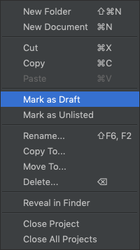

Draft folders or document files will be shown on the local website in live-reload mode but not on the exported website.

We can remove the "**Draft**" mark from the context menu as well.

### Unlisted

Sometimes, we want to hide a specific document from the navigation and access it only by URL. In that case, we can mark the document as "**Unlisted**".

"**Unlisted**" documents can only be accessed via direct links. They will not be shown in the documentation navigation or listing pages.

For example, pages like privacy policy, cookies policy, contact don't need to be listed in the navigation. Instead, we can set them in footer links.

To mark one or more documents as unlisted, right-click on the selected document files in the projects tree, and select `Mark as Unlisted` from the context menu.

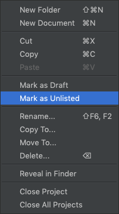

Clicking the `Remove Unlisted Mark` context menu item resets to listed state.

