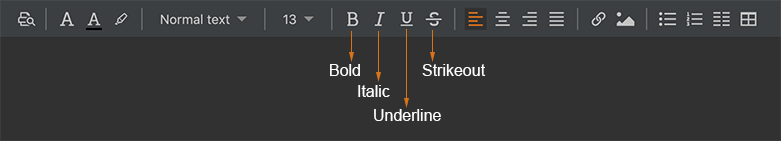
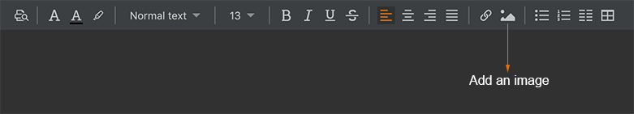
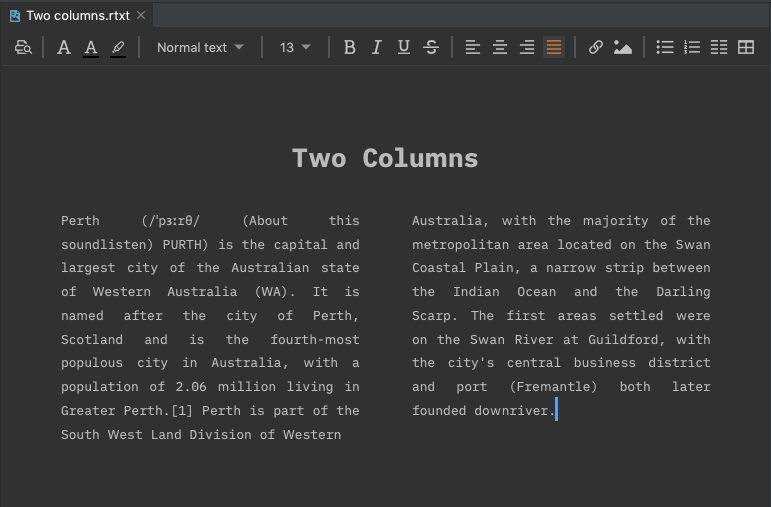
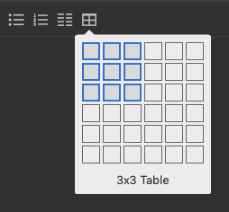

# Rich text editor

Sometimes, the Rich Text editor may be a better choice for writing. For example, when we edit a table directly without using the plaintext table syntax, or to have a two-column text block.

Any document files with the `*.rtxt` file extension will be opened in the Rich Text editor.

Similar to Markdown files, Rich Text documents can be generated into web pages as well. Click the "**Run**" button on the top right corner, you will have the web page opened in your web browser.

## Text font

To change the font of the selected text, click the "**Text font**" icon from the Rich Text toolbar.

After that, the System Font dialogue will pop up. You can choose a font available in your operating system.

## Text color

To change the text color, click the "**Text color**" icon from the Rich Text toolbar.

The system color dialogue will be shown, and then you can choose a different text color from there.

Depending on your operating system, the color dialogue may look like this on macOS:

The color dialogue on Windows may look like this:

And the color dialogue on Ubuntu may look like this:

## Text background

To change text color, click the "**Text background**" icon from the Rich Text toolbar.

The system color dialogue will be shown, and then you can choose a different text background from there.

## Text style

To change the text style, click the "**Text style**" combo box from the Rich Text toolbar.

And then select a text style from the dropdown menu.

## Text size

To change the text size, click the "**Text size**" combo box from the Rich Text toolbar.

And then select a text size from the dropdown menu.

## Text format

To apply standard text formats to the selected text, click on the corresponding toolbar text format icons.

We can make the selected text **bold**, **italic**, **underline**, or **strikeout**.

## Alignment

To align a paragraph to the left, centre, right, or both sides, click on the corresponding toolbar alignment icons.

## Inserting links

To insert a hyperlink for the selected text, click the "**Link**" icon from the Rich Text toolbar.

Type or paste a link into the text box and press **Enter** key.

## Inserting images

To insert an image into the current cursor position, click the "**Image**" icon from the Rich Text toolbar.

And then, the image popup, which lists all images within the current project, will be shown as below.

We can insert an image into the text editor directly by clicking a thumbnail or choose an external image by clicking the "**Folder**" icon on the top right corner.

## Lists

To insert a bulleted list or numbered list, click the corresponding icon from the Rich Text toolbar.

The text under cursor will be turned in a list.

## Two-column text

Click the "**Two-column text**" icon from the Rich Text toolbar, we can insert a two-column text into the current cursor position.

And then, we can input text in a two-column layout, which should be useful in some cases.

## Tables

To insert a table, click the "**Table**" icon from the Rich Text toolbar.

After that, from the popup, we can select how many rows and columns to insert into the rich text editor.

## Print preview

A Rich Text document can be printed directly. Click the "**Print Preview**" button from the toolbar.

The "**Print Preview**" dialogue will pop out, from which, we can preview and print the current document.

