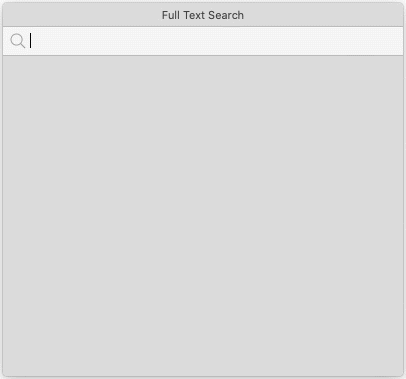
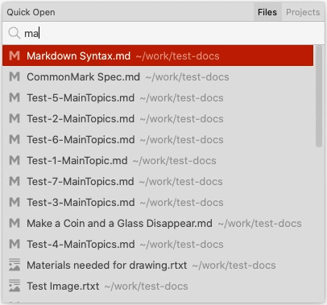

# Search in software

> `Full-text search` and `Quick Open` is only available in version `1.3.17+`. If you are using an old version, please upgrade to the latest one.

Full-text search is a fundamental feature of any content management software. It's convenient to find a specific document quickly, especially when you have more projects and documents. 

Document Node has full support on full-text search. Any projects (document folders) opened in Document Node will be indexed and searchable automatically.

Click the `Search` icon on the top toolbar or press `Cmd + Shift + F` (`Ctrl + Shift + F` on Windows and Linux), the full-text search popup will appear. Type keywords to search your content, and press the `Enter` key or click the selected row to open the resulting document.

You can also use the `Up` and `Down` arrow keys to select a different row from the result list.

All languages, including CJK (Chinese, Japanese, and Korean) are supported.

## Quick Open

While you can navigate the folders and files tree structure on the left side, it's convenient to quickly open any previous files or projects by searching the file name.

Select the menu `File` -> `Quick Open` or press `Cmd + O` (`Ctrl + O` for Windows and Linux), the `Quick Open` popup will appear, from which it lists the recent documents initially. You can type keywords to search documents by file name.

Type keywords to search your content, and press the `Enter` key or click the selected row to open the document. The `Up` and `Down` arrow keys can be used to select a different row from the result list.
