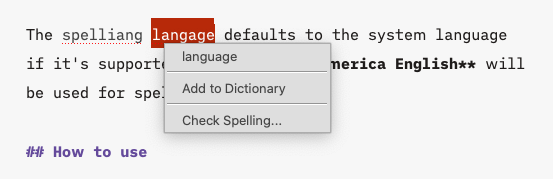
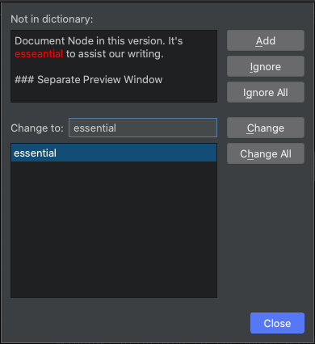
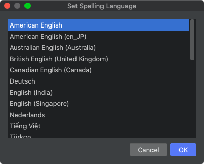
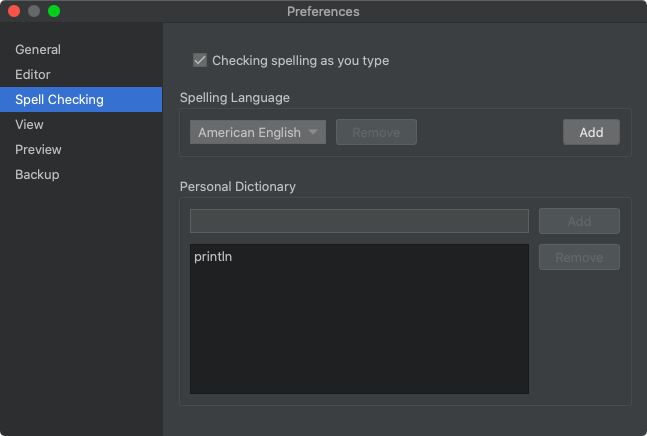

# Spell Checking

Spell checking is essential to any writing application. Document Node has built-in support for more than 10 popular languages on all platforms including macOS, Windows, and Linux. There are even more languages are supported on macOS.

> `Spell Checking` is only available in version `1.4.1+`. If you are using an old version, please upgrade to the latest one.

The spelling language defaults to the system language if it's supported. Otherwise, **American English** will be used for spell checking.

## Start spell checking

If your system language is supported for spell checking in Document Node, you don't need to do anything, and you can use the spell checking feature right away.

Any misspelled words will be underlined simultaneously while you are typing. Right-click on a misspelled word, any available suggestions will show on a popup menu.

Select the correct word to replace the wrong immediately. If you don't think it's misspelled, simply add it to your personal dictionary. Next time, it won't treat the word as misspelled.

## Check the whole document

From the suggestions menu, select `Check Spelling...`, and then a dialog will pop up to assist you in checking the spell of the whole document.

For the current misspelled word, you can choose to ignore, ignore all occurrences, change to a suggested word, change all occurrences to a suggested word, or add it to your personal dictionary. After each action, the next misspelled word will appear for you to decide, until all misspelled words are handled.

## Configuration

By default, the system language will be used for spell checking if it's supported. Otherwise, the default language will be set to **American English**.

You can change the default spelling language from the application menu `Tools` -> `Set Spelling Language...`.

Alternatively, you can configure a different language from the `Preferences` dialog (`Options` on Windows and Linux). Please go to `Preferences` -> `Spell Checking` (or `Tools` -> `Options...` -> `Spell Checking` on Windows and Linux), and select a new one.

There are a few more options on the `Spell Checking` page of the `Preferences` dialog. You can add a new dictionary by selecting a HunSpell dictionary zip file. You can also manage your personal dictionary there.
