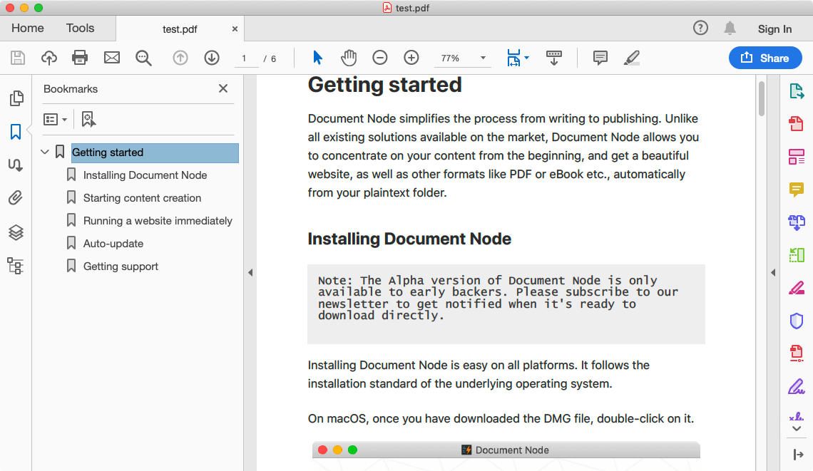

# Version 1.1.103 (alpha)

## Generating PDF bookmarks automatically

In the previous version, we implemented the feature of generating one or more PDF files from a Markdown folder. We knew for big PDF files, outlines and bookmarks are essential for easy-to-navigate.

Therefore, last week, we spent lots of time on this feature, and now it's available in this version. That is, PDF outlines (or bookmarks) will be generated automatically based on the headings of your documents.



The only thing you need to do is arrange your headings in Markdown files properly.

## Global & page-specific content templates

In this version, we can set a global content template as the default page layout for all documents.


Additionally, we can assign a specific page template to a particular document. It will be useful for a documentation site. For example, we can set a three-column layout as the global content template and set a one-column layout for pages like "privacy", "terms of use" page etc.

## Showing line numbers

We added a new option to the Preferences dialogue, to switch line numbers displayed in the text editor. Also, the number of lines is displayed at the bottom bar.

## Copying version info

We added a `Copy version information` button to the `About Document Node` dialogue so that when users want to report issues, they can copy the app version and relevant system information directly.

```
----------------------------------------
App version: 1.1.102-x86_64 (alpha)
Build Abi: x86_64-little_endian-lp64
Build CPU Architecture: x86_64
Current OS type: osx
Current OS version: 10.14
Current OS pretty name: macOS Mojave (10.14)
Current CPU Architecture: x86_64
----------------------------------------
```


## Miscellaneous improvements & fixes

* Fixed: ALT+SHIFT+Click on the green "maximize" button on Mac OS should resize the window to the full size of the screen without making the window go "full screen" in a new space
* Fixed: The cursor should not blink while moving it around with ALT+LEFT/RIGHT or CMD+LEFT/RIGHT
* Fixed: Should respond to standard Mac OS editing commands like ALT+BACKSPACE (delete word) and CMD+BACKSPACE (delete line)
* Fixed: The colour of the list item bullet was black in the preview, but it should be something with better contrast (also, the padding could be increased between the list item icon and the text)
* Added tooltips to the buttons at the top right corner, so we move the mouse over them it will show what they do
* Fixed: After pasting text, should scroll the cursor to be visible
* Improved interactions on documentation web pages
* Improved the preview to render soft line breaks as hard line breaks by default
* Updated Danish translations
* Improved the toolbar of the site builder: when the mode is changed, show a notification message to tell users what can be done
* Fixed problems when maximising the application Window on Windows 10
