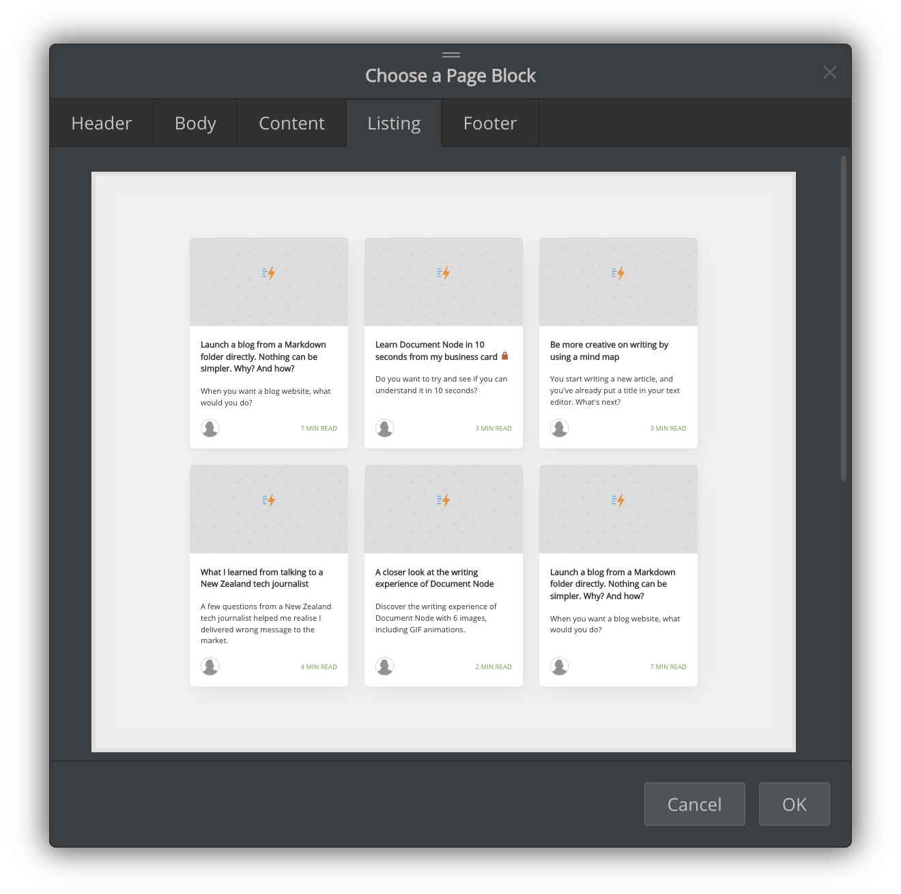
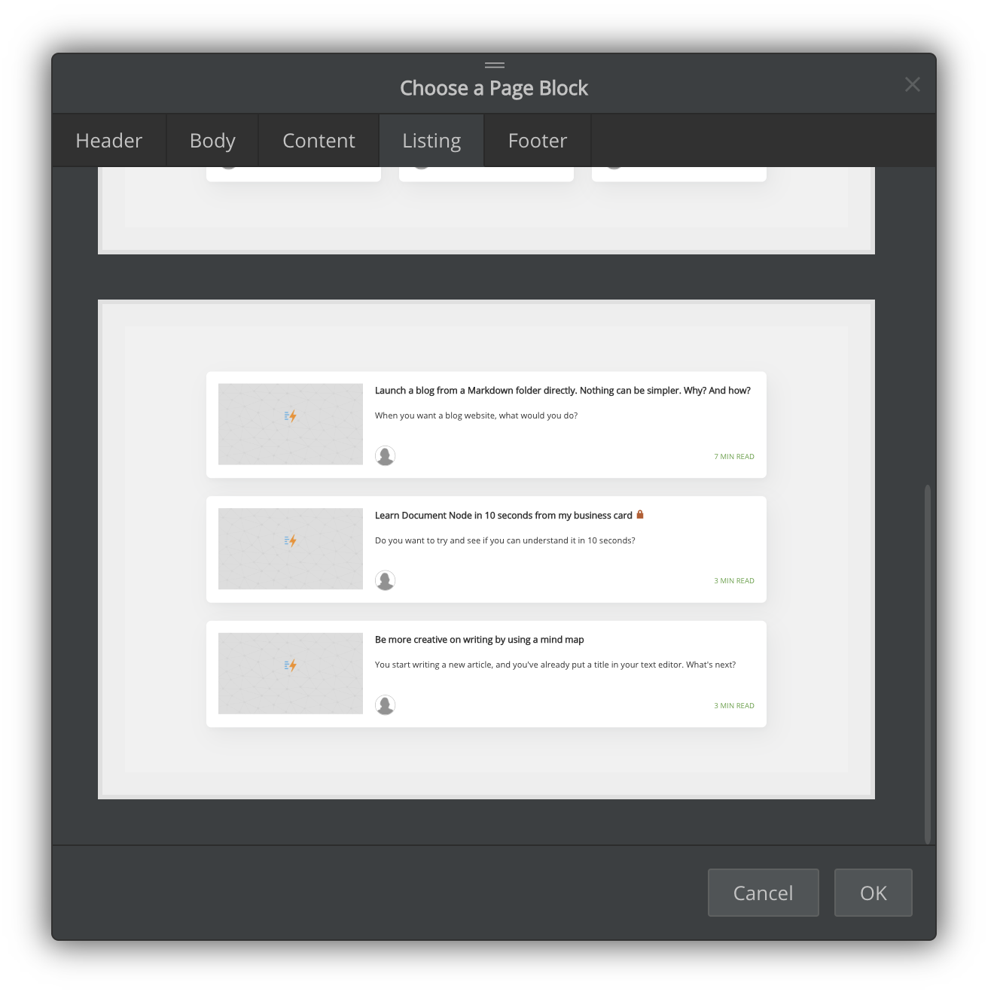

# Version 1.1.105 (beta)

## Showing draft icons on web pages

Folders or documents can be marked as a draft from the projects tree panel. Draft folders or document files will be shown on the local website in live-reload mode but not on the exported website.

In this version, we added 'draft' icons to the corresponding navigation items and document titles on the local web site to indicate the 'draft' status clearly.

## Two new listing blocks

We implemented two new page blocks for listing blog articles - Card View and List View. On scrolling, it will load the next page automatically until all posts are loaded.

*Cards View*

*List View*

Additionally, the reading time of each article is calculated automatically and shown on the listing cards or list items.

## Author avatar

In this version, you can set a default avatar for all your blog posts, or give an avatar for a particular article.

The avatars will also be displayed on the blog listing page.

## Marking as unlisted

"Unlisted" documents can only be accessed via direct links. They will not be shown in the documentation navigation or listing pages.

For example, pages like privacy policy, cookies policy, contact don't need to be listed in the navigation.

To mark one or more documents as unlisted, right click on the selected document files in the projects tree, and select 'Mark as Unlisted'.

Clicking the 'Remove Unlisted Mark' context menu item resets to listed state.

## Miscellaneous improvements & fixes

* Added block names in page blocks chooser
* In the 'Global Page Settings' dialogue, show the "Default Content Template" tab before the "Page Code Injection" tab
* In documentation navigation, link folder items to their first document
* Fixed translation issues
* Fixed: Could not choose a different project folder in the "New Folder" dialogue when no projects are open
