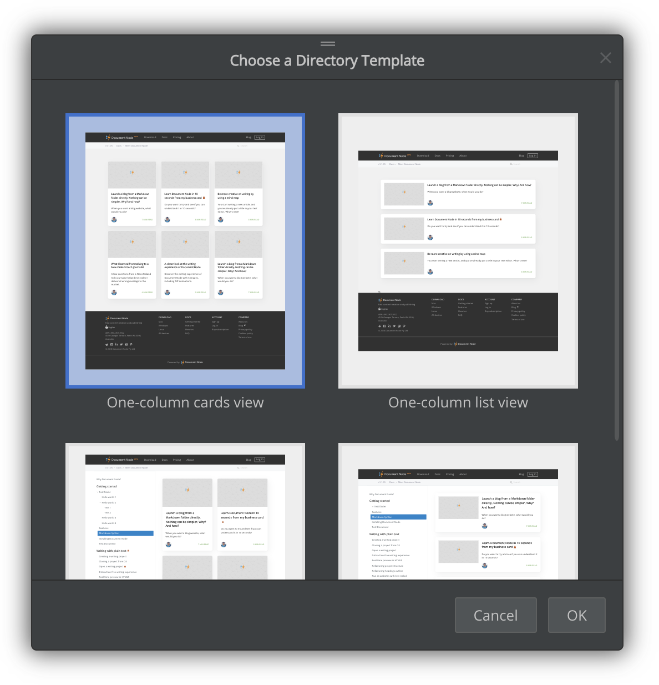
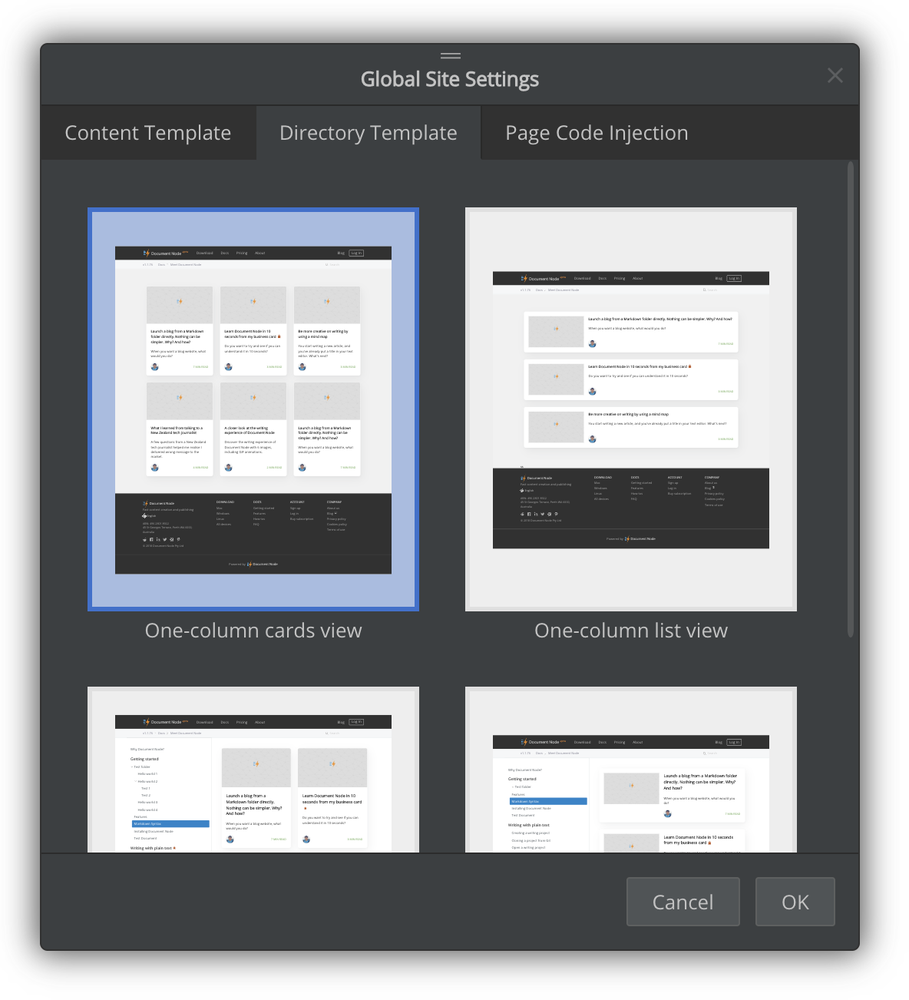

# Version 1.1.110 (beta)

## Directory listing page (simple but powerful)

In this version, we implemented 4 new page blocks for directory listing:

* One-column cards view
* One-column list view
* Cards view with navigation
* List view with navigation

One-column page blocks can be used in blog websites or company websites. For example, you can classify your blog posts into different folders, and each folder's corresponding web page will list all posts under this folder. When you configure these folder links as top menu items, you will have a decent blog site with categories.

Two-column page blocks can be used in documentation sites, which generally have navigation on the left.

In addition to choosing a listing template for a specific directory page, you can also configure a global directory template which will be used for all directory pages by default.

All directory listing page blocks will only show the first page initially. When scrolling to the bottom, they will load the next page automatically.

## Single-clicking to preview documents

We improved the default clicking behaviours on the left project files tree. Now single-clicking on a document will open it as a preview tab in the editor area. Double-clicking will open it in the normal editing mode.

Only one preview tab will be opened at any time, which means single-clicking on different documents will always show document preview in the same editor tab.

## Miscellaneous improvements & fixes

* Improved the performance of opening a document in an editor tab
* Automatically detect cover the image description in a Markdown file
* Fixed images path issues in page block thumbnails
* Close active popups via the ESC key press both in the desktop application and the browser
* When creating a new project, document or folder, any illegal characters in the file name will be cleaned up automatically
* Fixed: when folder names contain spaces, resources inside were copied to wrong output locations
* Fixed the shortcut issue of `View` -> `Editor Only` menu item on Windows by using the `Ctrl+Shift+E` key combination