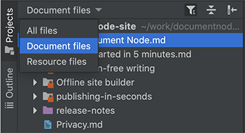
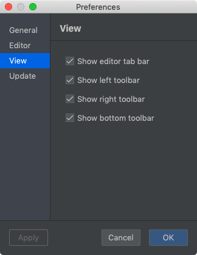

# Version 1.1.114 (beta)

## Github Flavored Markdown

A few extensions provided by Github Flavored Markdown are beneficial for writing documentation. Specifically, they are:

* tables
* task-list items
* strikethrough texts
* extended auto-links

In this version, we enabled the GFM parser in the application, so the extended Markdown syntax will be rendered into HTML correctly, although some improvements are still in progress:

* Strikethrough highlighting in the Markdown editor and preview panel
* Tables highlighting in the Markdown editor
* Task-list style in the preview panel and generated web page
* Auto-links highlighting in the Markdown editor

They will be available next week.

## Filters on project files tree

When image files (or other resource files) are listed together with document files in the projects tree, it's sometimes annoying, because most times we only care about document files.

In this version, we added a couple of filter options to the projects panel. Please see the screenshot below:

When clicking on the project title, we can choose what to show in a dropdown popup:

* All files
* Document files (the default state)
* Resources files (show non-document files only)

We can also use the filter icon to toggle between "Document files" and "All files".

## View options in the Preferences dialogue

We added view options in the 'Preferences' dialogue. These view options will be remembered even we restart the app.

For example, if you don't want to have the editor tab bar, you can hide it by unchecking the 'Show editor tab bar' checkbox.

## Miscellaneous improvements & fixes

* Fixed issues of loading the next page automatically
* Fixed the hanging problem when running projects from the application menu
* Fixed the problem of loading projects in the wrong order when the app is restarted