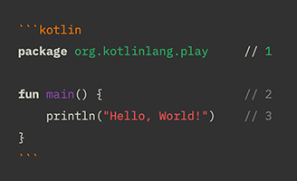

# Version 1.1.116 (beta)

## Supporting 310 languages for code highlighting

We are so excited to let you know that in this version we added a generic syntax highlighting engine, which supports 310 languages.



Code blocks highlighting happens in three places:

* The Markdown editor
* The preview panel
* The web page generated

That is, without any other plugins or configurations, by only using Document Node, you will get all your code syntax-highlighted in all places, as well as your website, blog, or online documentation.

Here is a Python example of code highlighting:

```python
def insertion_sort(arr):

    for i in range(len(arr)):
        cursor = arr[i]
        pos = i
        
        while pos > 0 and arr[pos - 1] > cursor:
            # Swap the number down the list
            arr[pos] = arr[pos - 1]
            pos = pos - 1
        # Break and do the final swap
        arr[pos] = cursor

    return arr
```

If you are a technical writer, I'm sure you will love it.

## Improved text size and line length settings

In the 'Preferences' dialogue, we improved the text size and line length settings. Please see the screenshots below.


*Text size settings*


*Line length settings*

## More flexibility to drag and drop folder/files

In the previous version, reordering can only happen at the same level. In this version, we improved this feature to allow us to move folders/files to an arbitrary location in the projects tree, without any restrictions.

## GFM Tasklist style

We improved the GFM (Github Flavoured Markdown) tasklist style in the preview panel and web page.


## Strikethrough button in the format popup bar

We added a new 'Strikethrough' button to the format popup bar. Now, by selecting some text and clicking the 'Strikethrough' button, we can quickly mark the selected text as a strikethrough style.


The keyboard shortcut `Alt+Shift+D` is also available to accomplish the same task.

## Document Node is notarized by Apple

To create a safer Mac user experience, we went through a process to make sure Document Node is appropriately signed and notarized by Apple.

The notarized app will give users more confidence that the software they download and run, no matter where they get it from, is not malware by showing a more streamlined Gatekeeper interface.

## Miscellaneous improvements & fixes

* Ignore single-click events when multiple tree items are selected, or the `Shift` key is down
* Implemented Strikethrough highlighting in the Markdown editor
* Improved Strikethrough style in the preview panel
* Activate the application window and set focus after drag-and-dropping files into the text editor
* If some text is selected and they are not cross multiple lines, then we can type ` to mark it as inline code
