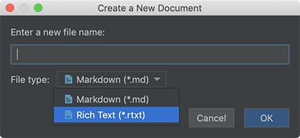
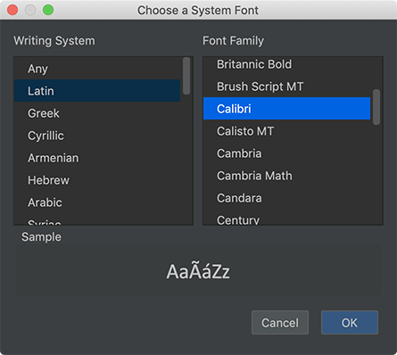

# Version 1.1.117 (beta)

## Hello Rich Text

While Markdown let us focus on content instead of formats, the Rich Text editor is the tradition where what you see is what you get (WYSIWYG). Most of us get used to rich text editors already. Why not can we enjoy both?

As requested by some beta users, in this version, we implemented a basic version of the Rich Text editor in Document Node.

When you create a new document, now you can choose a `Markdown` file type or `Rich Text` type from the dialogue.

*Choosing a file type when creating a new document*

If you choose the 'Rich Text' format, you will be able to edit the new document in the rich text editor.

Many details of the rich text editor are not perfect, and we will continue improving it. More features like screenshots taking, image inserting, table editing etc will be added shortly.

If you have any feedback, please don't hesitate to let us know. Dealing with users' feedback is always our top priority.

## Choosing a System Font

Being able to choose a system font gives us a wide range of font options in the text editor. In this version, we improved the `Editor` settings in the `Preferences` dialogue so that we can browse and select a system font.

*Choosing a System Font on macOS*

*Choosing a System Font on Windows*

Open the `Preferences..` from the main application menu, and select `Editor` on the left side, and then you change the font using the system font dialogue.

