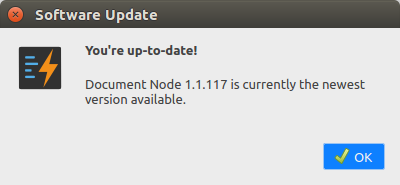

# Version 1.1.118 (beta)

## Links, images, lists and tables

We continued to improve the rich text editor. In this version, we can insert links, images, bulletin lists, ordered lists, two-column text blocks, and tables into the rich text editor.

For example, we could create a two-column text block like this:

When clicking the table icon, we can select how many rows and columns to insert into the rich text editor.

The good news is, all shortcuts of the Markdown editor are also available for the rich text editor.

## Text color and background

Additionally, we added two more toolbar buttons in the rich text editor so that we can change the text colour and text background.

## One-click to run in a website

The beauty of the Document Node rich text editor is that you can publish your writing into a website with only one-click. Any changes will be updated to the web page simultaneously.

We optimized the generation of web pages from the rich text documents. Just concentrate on your content, and get a website immediately and automatically.

## Improved print preview dialogue

In this version, we improved the appearance of the print preview for the rich text editor, to be consistent with other parts of the user interface.

Click the 'Print Preview' button on the toolbar of the rich text editor to open this dialogue.

## Checking for updates on Linux

From this version onwards, we can check for updates on Linux as well. Click `Help` -> `Check for Updates...` menu, we can check updates manually.

If no updates found, you will see the following dialogue to confirm that you are already up-to-date.

If a newer version is detected, it will notify you with the following dialogue.

From there, you can see release notes, or download the latest version directly. After you download it, you will need to quit the application and launch the new version.

## Miscellaneous improvements & fixes

* Don't add the default title when creating a new document
* Fixed cursor issues around images in the rich text editor
