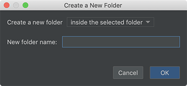

# Version 1.1.121 (beta)

## Location of a new folder/document

As we know, the order of folders and files in the project tree structure are manageable by drop-and-drop. The project tree structure can be mapped to the navigation of your documentation site directly, which means, it will be so easy for you to update your document structure.

To create a new folder or document at a specific location, we improved the `New Folder` and `New Document` dialogue slightly.

If we have selected a folder/document, and we want to create a new folder/document, from the dialogue, we can choose a location relative to the selected item.

*Choose a location when creating a new folder*

*Choose a location when creating a new document*

If the selected item is a folder, we can choose to create the new item:

* above the selected folder
* inside the selected folder, or
* below the selected folder

Moreover, if the selected item is a file, we can choose to create a new one:

* above the selected file, or
* below the selected file

You most recent choice from the combo box will be remembered.

## Miscellaneous improvements & fixes

* Fixed an issue of auto-loading next pages when scrolling on directory pages
* Fixed quote left keypress issues in the Markdown text editor
* Improved the `New Document` dialogue to remember the recent file type a user has chosen
* Fixed a single-click issue in the projects tree
* Fixed a display issue of two-column text blocks on the generated web page
* Fixed a selection background issue inside table cells
* Added an introduction video on the home page of https://documentnode.io
