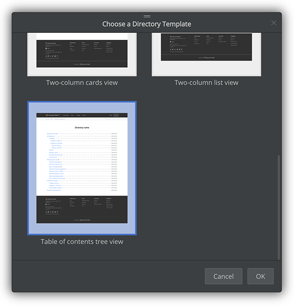

# Version 1.1.122 (beta)

## New 'Table of Contents' page block

When generating a web site from a document folder, each document file can have a web page generated. What about directories inside the document folder?

Previously, we implemented four templates you could choose:

* One-column cards view
* One-column list view
* Two-column cards view
* Two-column list view

Now, in this version, we added a new directory template: "Table of contents tree view". With it, you can list all descendant links of a specific directory on one page, as a table of contents.

When you are on a directory page, click the "Page Template" toolbar button:

Then, choose it from the dialogue to switch to the TOC page layout.

The same TOC page block can be used in your custom pages as well.

Just add the block to your page, then done! All documents in your project will be listed here.

## Miscellaneous improvements & fixes

* Improved the site builder toolbar to show the 'Page Template' button directly for directory and content pages without the need to enable Designing mode
* Fixed an issue of the directory page so that it can list all descendant documents of the folder
* Optimised the side-by-side preview performance to make sure it never impacts keyboard typing
