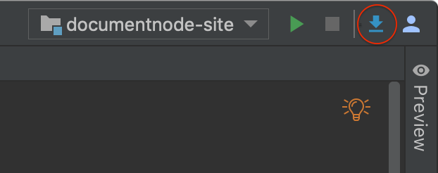
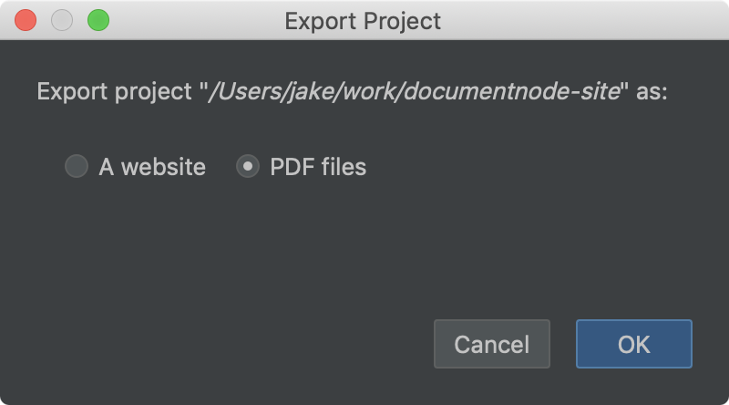
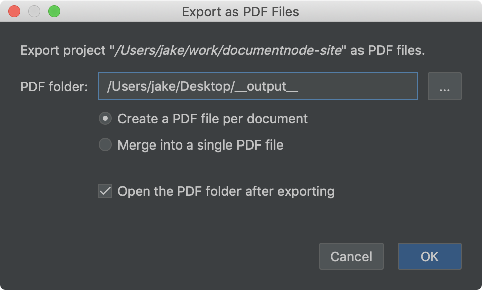

# Version 1.1.99 (alpha)

## Exporting a project as PDF files

In addition to exporting a project as a website, now we can export a project as PDF files.

From the top right toolbar, click the 'Export' button, you will see 'Export Options' in a dialog box:

Choose 'PDF files', and click 'OK', then we will be able to choose whether we want to export a PDF file for each document, or create a single PDF file by merging all documents together.

When merging all documents of a project into one single PDF file, the order follows the structure of documents in the project. As we can easily change the order of documents by drag-and-dropping in the projects tree, the structure of PDF files generated can be quickly updated as well.

We are in progress of implementing a feature to automatically add outlines (aka. bookmarks) to PDF files. It will be available next week.

## 'Reveal in Finder' or 'Show in Explorer'

A new menu item,

* 'Reveal in Finder' (on macOS), or
* 'Show in Explorer' (on Windows), or
* 'Open Directory' (on Linux),

Was added to the context menu of the projects tree. Select this menu item to show the file or folder in the system file manager.

## Miscellaneous improvements & fixes

* Added a warning message to confirm with users before cleaning the website output directory
* Fixed an issue of copying and pasting files in the projects tree
