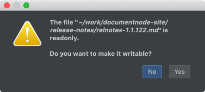

# Version 1.2.125 (alpha)

## Writing a read-only file

If we are trying to edit a read-only file, the application will prompt us to decide whether we want to make it writable or not.

If we choose "Yes", it will make the file writable and save changes; otherwise, the edits will get reverted.

This is useful when you get read-only documents on your operating system, but you want to edit in Document Node.

## The 'diff' between documents

Being able to see the differences among documents is fundamental to many productive writing workflows, such as revision history, team collaboration.

In this version, we have integrated the diff ability into the application. Although we cannot see anything related to the diff function from UI at the moment, the door of adding more native, lightweight features is widely open.

We will add functions of local history and version control into Document Node in the future so that we don't need to worry about backup and collaboration with other team members.

## Miscellaneous improvements & fixes

* Fixed an issue of checking updates on Ubuntu. If the latest version detected is older than the current version, it should not show the Software Update dialogue.
* Fixed style issues of web pages generated from rich-text documents
* Automatically detect YouTube links from a rich-text file and display as videos on the web page generated