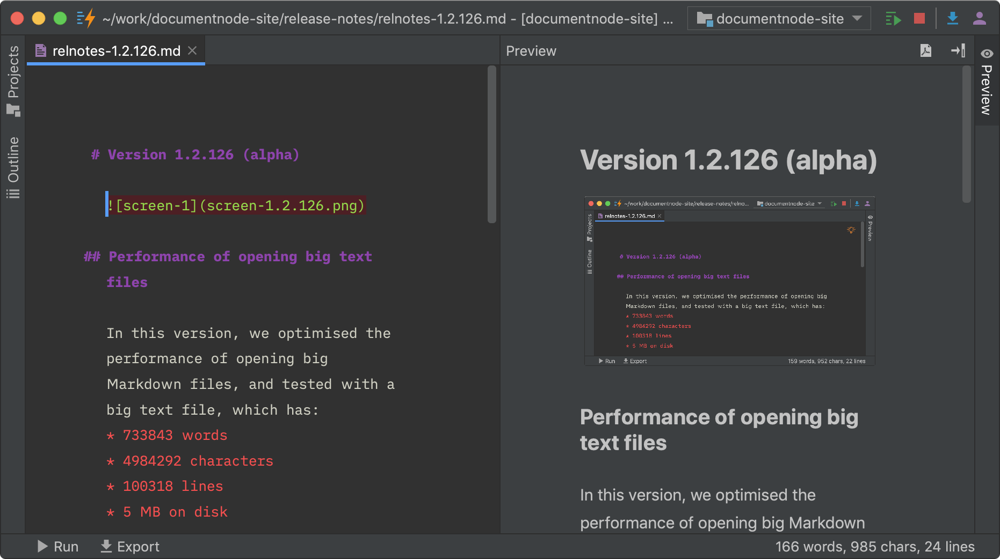

# Version 1.2.126 (alpha)

## Performance of opening big text files

In this version, we optimised the performance of opening big Markdown files, and tested with a big text file, which has:
* 733843 words
* 4984292 characters
* 100318 lines
* 5 MB on disk

The test file can be opened in 2 seconds, with syntax highlighting enabled, which should be enough for 99% use cases, as document files tend to be not that big.

## Writing files safely

Additionally, we improved the file writing feature to ensure that no data at the final file is lost in case an error happens while writing, such as the disk is full or any reasons.

Data security is always the top priority of Document Node, we will implement more features around this principle. For example, when you delete a file or document from Document Node, they will only be moved into your trash can, so that you can put them back if you change your mind.

Also, we will add local history and version control features, so that multiple copies can be found whenever you need.

## Miscellaneous improvements & fixes

* Fixed an issue of creating new documents when a project is selected, which should create new files inside the selected project
* Fixed issues when single-clicking between Markdown and Rich Text files
* Set the maximum number of open tabs to 15
* Improved the editor tab styles slightly