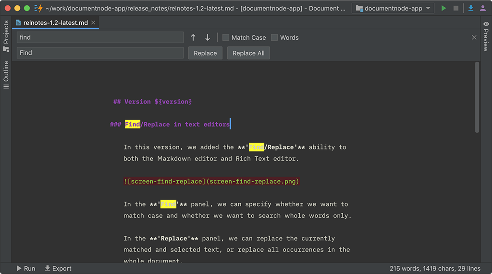

# Version 1.2.127 (beta)

## Find/Replace in text editors

In this version, we added the **'Find/Replace'** ability to both the Markdown editor and Rich Text editor.

In the **'Find'** panel, we can specify whether we want to match case and whether we want to search whole words only.

In the **'Replace'** panel, we can replace the currently matched and selected text, or replace all occurrences in the whole document.

All relevant shortcuts are supported on all platforms. Please see the details from the table below:

| Acrtion/Shortcuts  | macOS | Windows | KDE Plasma | GNOME
| ------------- | ------------- | ---- | ---- | ---- |
| Find  | `Cmd+F` | `Ctrl+F` | `Ctrl+F` | `Ctrl+F` |
| Find Next  | `Cmd+G`  | `F3`, `Ctrl+G` | `F3` | `F3`, `Ctrl+G` |
| Find Previous  | `Cmd+Shift+G`  | `Shift+F3`, `Ctrl+Shift+G` | `Shift+F3` | `Shift+F3`, `Ctrl+Shift+G` |
| Replace  | `Cmd+R`  | `Ctrl+H` | `Ctrl+R` | `Ctrl+H` |

We will polish the 'Find/Replace' functions gradually in the future.

## Miscellaneous improvements & fixes

* Improved the site builder templates to allow empty site logos
* Fixed issues of custom page block to allow zero height, which means we can use custom page blocks to inject JavaScript code as well
* Fixed empty links of Table of Contents on custom pages
* Fixed issues to keep `draft` or `unlisted` status after reordering files or folders