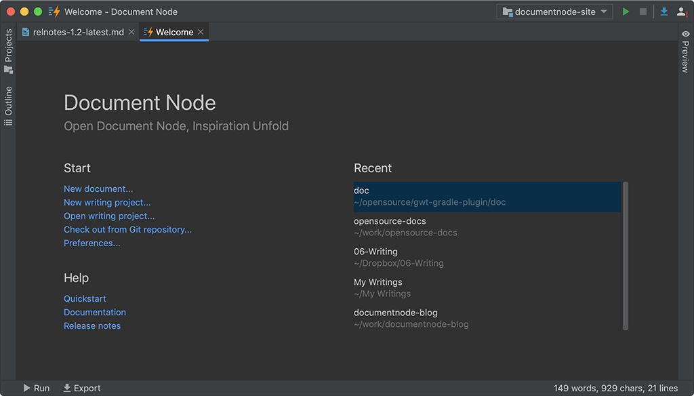

# Version 1.2.128 (beta)

## Available for public download

We've made the latest beta version available for the public to download.

Please head to the [download page](https://documentnode.io/download) and download the latest version for your operating system.

On macOS, you will download a DMG file. Double-click the DMG file and simply drag-and-drop to your `Applications` folder.

On Windows, you will download an MSI installer. Double-click the MSI file and follow the installation wizards to finish the installation.

On Linux, you will download an AppImage file, which is similar to an App file on macOS. Just give the AppImage file executable permission, and then double-click it to open Document Node.

Next step, we will focus on polishing our documentation, finalizing the first stable version, and developing new features for the next major release.

Today's version is a minor update, and please see the improvements and bug fixes below.

## Improvements & fixes

* Improved the site builder to allow setting javascript method calls as the "href" attribute of HTML anchors
* Fixed issues of dragging SVG/GIF images from a web browser to Document Node text editor
* Fixed a scrolling issue of the text editor when writing at the bottom of a long document
* Improved the navigation style of the documentation page template
* Fixed a stability issue when typing too fast in the text editor
* Improved `Help` links on the Welcome page and app menu
* Added `Find` and `Replace` menu items to the `Edit` menu
