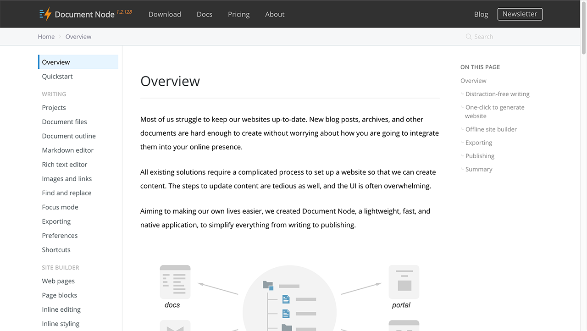

# Version 1.2.129 (beta)

## Documentation of Document Node

We have finished the first version of the documentation of Document Node and published on the website (https://documentnode.io/overview).

We will update it with each new release, or whenever any issues are spotted.

The documentation has three categories at the moment: Writing, Site Builder, and Publishing. It presents the major functionalities of Document Node we have developed so far.

On the left side, you can navigate to different document pages. And on the right side, you can see the table of contents of the current document page.

Please let us know (support at document dot io) if you spot any issues or are confused about anything mentioned in the documentation.

## Optimized the performance of opening file

In this version, we reduced the time spent on opening a document tab from 150-380 milliseconds to 0-20 milliseconds, for both the single-click and double-click events. This results in a much quicker response in UI.

It's crucial to have quicker UI response to deliver the best user experience whenever possible. As Document Node is written in C++, it has the full potential to run faster and makes your writing experience pleasant.

## Miscellaneous improvements & fixes

* Fixed an issue of text color-switching after the current theme has been changed
* Improved the performance of editor tab switching
