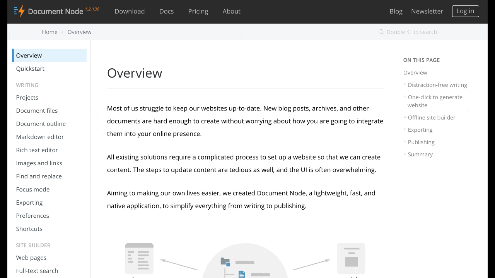

# Version 1.2.130 (beta)

## Full-text search built-in

In this version, we added the full-text search-ability for the websites exported from Document Node. It's built-in and works out of the box without any configuration.

For more information, please see the document: https://documentnode.io/site-builder/full-text-search

The full-text index is automatically generated when you publish your static website to Document Node hosting or somewhere else. Nothing needs to be manually configured.

Double-tap your `SHIFT` key, a little search box will be shown, where you can type your search terms. While you are typing, suggested search results will list below. And then, you can use `Up` and `Down` arrow key to select a result that you are looking for, and press `Enter` key to open the target document.

All documents in your project will be indexed automatically.

We will implement full-text inside the desktop software as well in the future. It will allow you to quickly find any documents in a project and start to work on it.

## Miscellaneous improvements & fixes

* Fixed issues of normalizing image paths and resource paths when generating web pages
* Fixed an issue of Markdown syntax highlighting delay
* Fixed an issue of PDF exporting to make sure the light theme is used for code blocks highlight
