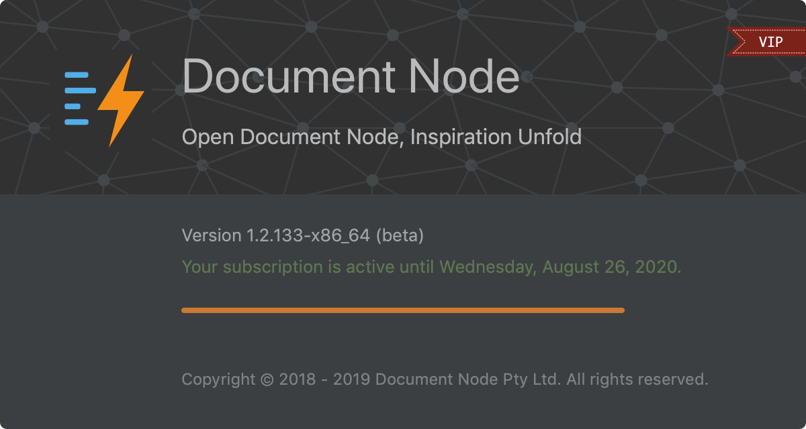
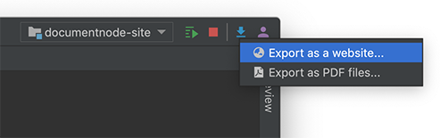
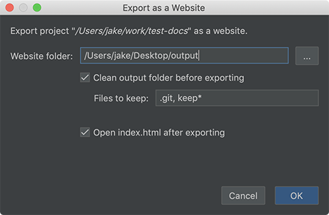
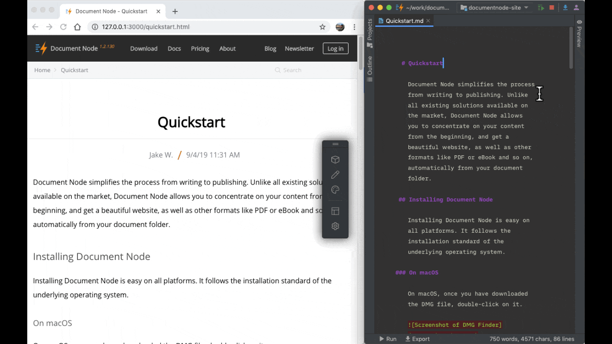

# Version 1.2.133 (beta)

## Improved exporting UI

In this version, we improved the exporting UI to make it easier to use. Instead of using a dialogue box to choose whether to export as a website or PDF files, now we use a dropdown menu.

We also added an option to specify "Files to keep" on cleaning the website output folder.

Wildcards are supported in file names. Multiple file names should be separated by commas.

All exporting options will be remembered so that next time when we export a project, we can reuse the previous settings.

## Synchronising scroll bar with web page

While you are writing at the bottom of your text editor in Document Node, you often want to switch to your web browser and see the current sentence on the page. 

With this new feature of synchronising the scroll bar position between the text editor and the web page, we don't have to scroll to bottom any more manually.

The same feature is available in the Rich Text editor as well.

## New 'About me' page block

If you are a blogger, you may be glad to see the new 'About me' page block brought to you in this release.

As all page blocks do, this page block is mobile-friendly, and you are free to change the photo, texts, social links, text colours, background colours and more.

## Miscellaneous improvements & fixes

* Improved the positioning of the site builder toolbar
* Improved page blocks to allow removing 'Log in' button from headers
* Fixed a bug occurred when creating new folders in a project root directory
* Fixed a clipboard issue to allow pasting multiple times after copying files in the projects explorer
* Fixed an issue in local running mode to make sure the search result links work when the URL contains a bookmark hash
* Improved empty custom pages by enabling the designing mode by default
* Improved site builder's toolbar so that we press `ESC` to reset to the normal browsing mode
* Improved inline editing to allow inputting line breaks and use `Ctrl+Enter` to finish editing
* Improved the feature of replacing a page block to keep the associated data for reuse if possible
* Fixed an issue to keep the `draft` and `unlisted` status when renaming, moving or copying a folder
* Added `VIP` ribbon for licensed users
