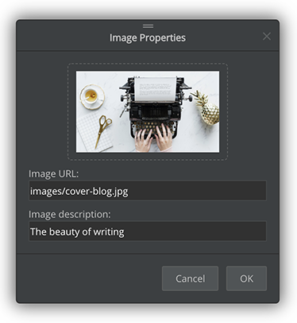
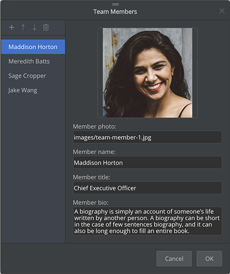
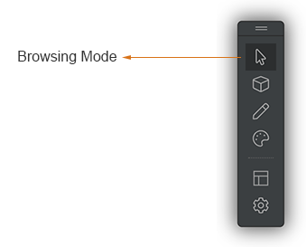
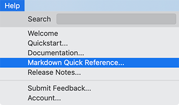

# Version 1.2.134 (beta)

## Improvements for page block data editors

We redesigned the page block data editors so that they can be extendable. It will unleash the power of flexibly creating tons of more page blocks.

In the meantime, we improved the image editor with a new thumbnail preview,

and implemented a new data editor for the "Team Members" page block.

## New 'Browsing Mode' toolbar button

In addition to pressing the `ESC` key to switch back to the normal browsing mode, we added a new `Browsing Mode` button to the site builder toolbar.

## Markdown quick reference

We added a new menu item: `Help` -> `Markdown Quick Reference...`, linking to the Github flavoured markdown syntax guide.

## Miscellaneous improvements & fixes

* Improved the blog post cover image not to restrict the image size to 16x9
* Enabled the editing of the blog cover image
* Fixed sorting issues of listing page blocks so that new documents will appear first
* Improved cards view and list view to show the creation date on each item
* Added a 'Draft' icon to the blog title page block if it's in 'Draft' status
* Fixed issues of URL generation when invalid characters are in file names
* Fixed display issues of the search box on the mobile screen
* Improved the scroll bar synchronizing to scroll the web page to bottom when no scroll bar appears in the text editor
* Improved the single-click on project files to not set focus in the text editor automatically
* Defaulted the site logo link to 'index.html' and made it editable
