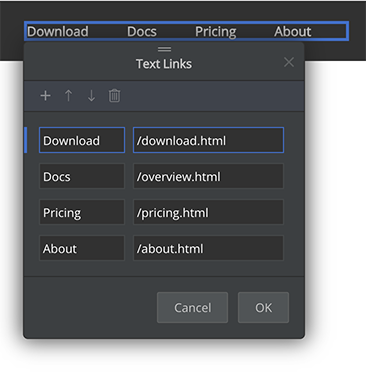
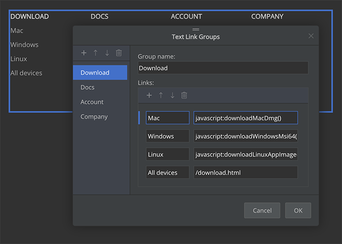
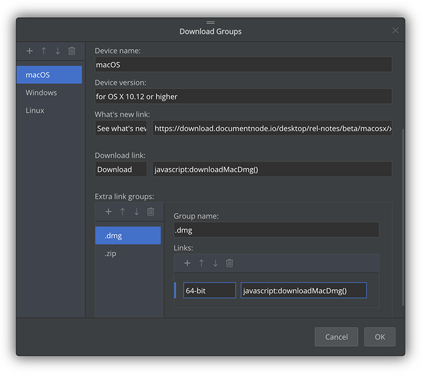
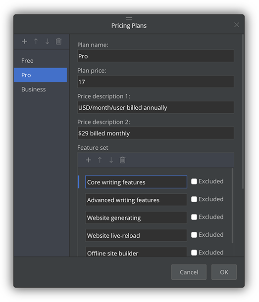

# Version 1.2.139 (beta)

## More page blocks data editors

Last week, we continued to improve the data editors of page blocks. The `Text Links` editor and `Text Link Groups` editor has been enhanced using the new generic UI layout.

In the `Text Links` editor, we can easily add or remove text links, or change their order. This editor is used to edit text links such as top navigation menus.

In the `Text Link Groups` editor, we can quickly modify groups of text links. A typical example is the footer columns of links.

We also created two new data editors: `Download Groups` editor and `Pricing Plans` editor.

In the `Download Groups` editor, we can change every detail of the Download page block.

In the `Pricing Plans` editor, we can modify all information of the `Pricing Plans` page block.

The new data editors make it possible to reuse these page blocks completely.

## Miscellaneous improvements & fixes

* Improved the docs navigation style slightly
* Fixed the issue of wrong creation dates on the next pages of Cards View and List View
* Fixed path issues of the breadcrumb root URL
* Improved the site builder to update the latest block HTML automatically on the Software upgrade
* Fixed issues of unnecessary context menu when switching from editing mode to browse mode
* Fixed an auto-list issue when there are no page blocks after the listing block
