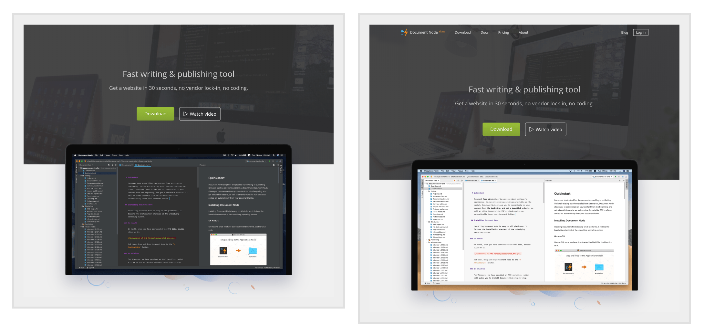
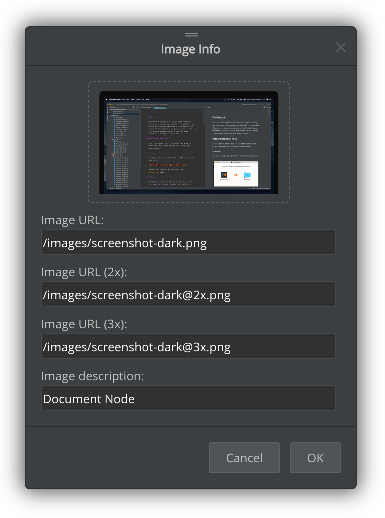
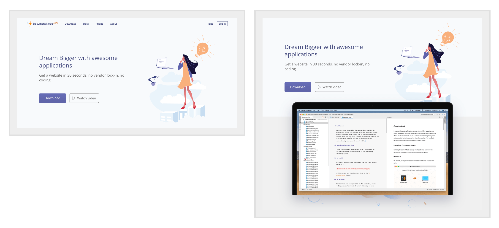
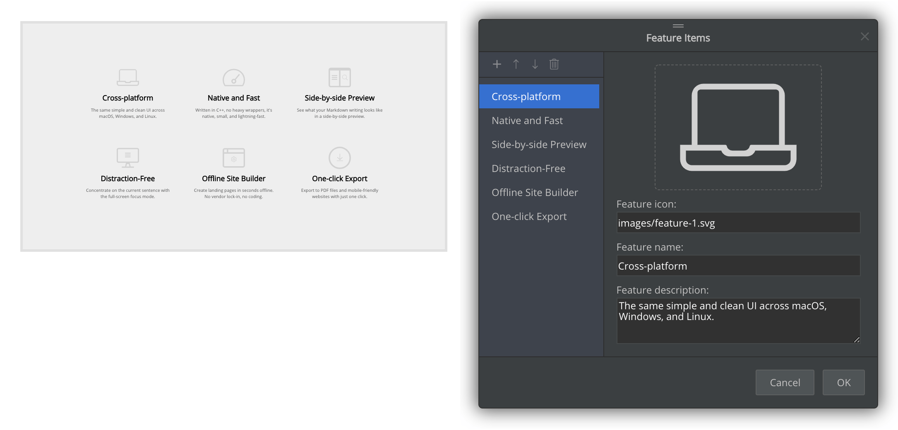
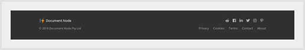
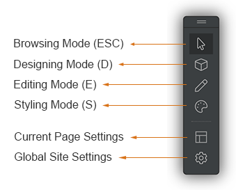

# Version 1.2.140 (beta)

## New page blocks for making landing pages

**Product show**

If you have an excellent product photo or screenshot that you want to display on your landing page, you can leverage the new page blocks included in this release on your landing page.

The product image is responsive to different monitors, which means when editing, you can provide multiple image URLs accordingly.

**Illustrations**

A couple of new illustration page blocks are also suitable for making landing pages.

**Feature items**

It's a typical requirement to list the feature set of your product briefly on your landing pages. With the new `Feature Items` page block, it becomes so easy to add such UI elements to your pages. Using the offline site builder, you can modify the icons and texts to your own.

**Simple page footer**

Sometimes, we just need a simple footer with less information, for example, on a landing page. So, we created a simplified page footer.

**Custimisible, as always**

As always, everything, including texts, images, links, text colour, background colour, background images, and so on, can be modified easily using the offline site builder.

All new page blocks introduced in this version are mobile-friendly.

## Shortcuts for switching modes

We added keyboard shortcuts for switching to different modes. Press ESC to switch back to the normal browsing mode, and press D, E, or S (if not typing in an input box) to switch to the designing mode, editing mode, or styling mode respectively.

## Miscellaneous improvements & fixes

* Fixed issues on Windows 8 on application launch
* Fixed issues on the site generator to skip unrelated HTML files in asset directories, which makes it faster to launch the website in running mode