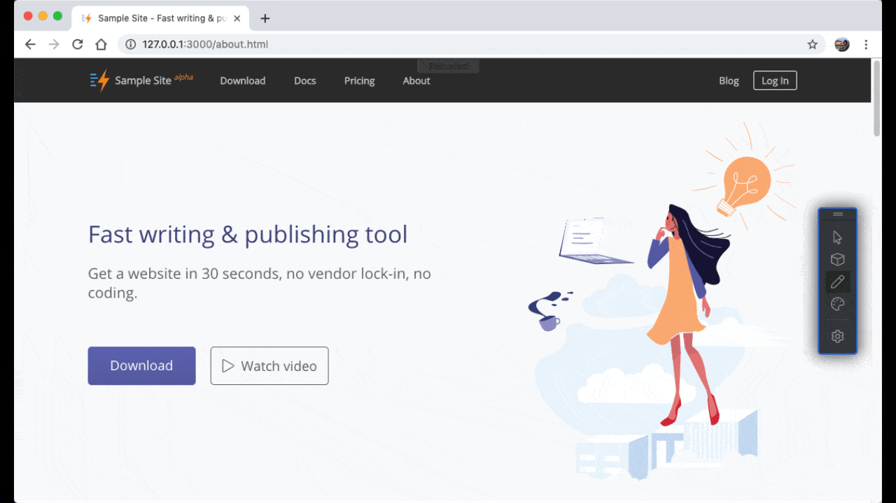
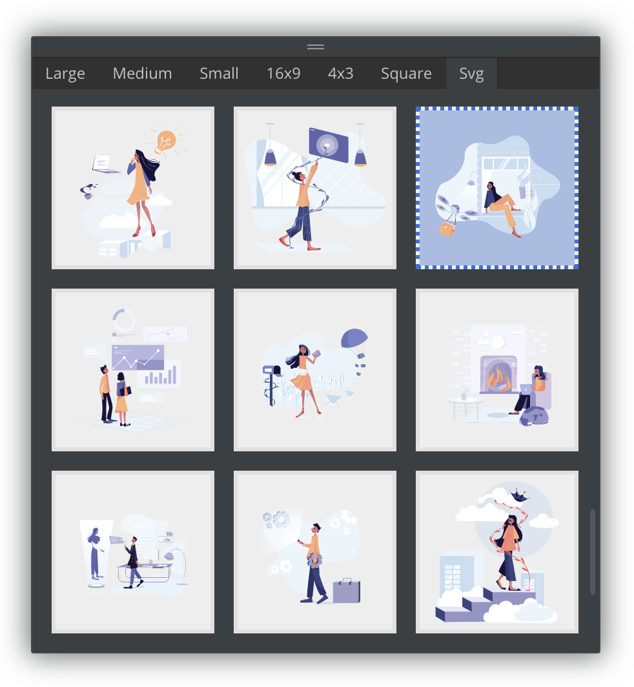
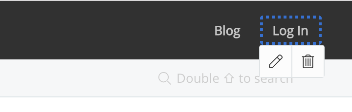
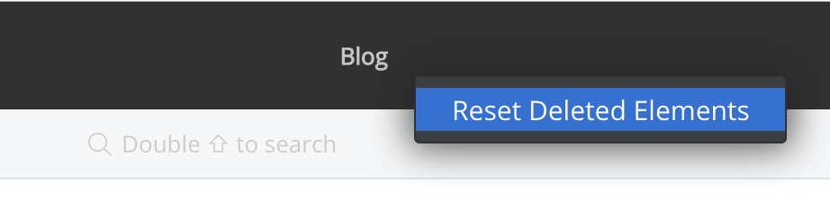

# Version 1.2.141 (beta)

## Smart image chooser for the site builder

In this version, we added a smart image chooser for the offline site builder. When you modify any images on your web pages, this image chooser will list all project images in a few groups:

* Large
* Medium
* Small
* 16x9
* 4x3
* Square
* Svg

Any images added to the project folder will appear in this image chooser automatically, which makes adding images much easier comparing to typing the image URLs manually.

In the future, we will improve this dialogue, for example, you will be able to search images from different sources directly from this dialogue, and you will be able to open images from your operating system.

## Simple toolbar for editable elements

To quickly delete unnecessary elements from a page block, we added a simple toolbar with a 'Delete' button.

If you want to bring the deleted elements back, simply click elsewhere of the page block and then click 'Reset Deleted Elements' from the context menu.

## Miscellaneous improvements & fixes

* Fixed issues of creating custom pages with one or more parent folders
* Fixed the default background colour issue of blog cover images
* Fixed issues of Unicode characters in the anchors of Table of Contents (TOC)
* Fixed an issue of site builder shortcuts during inline editing