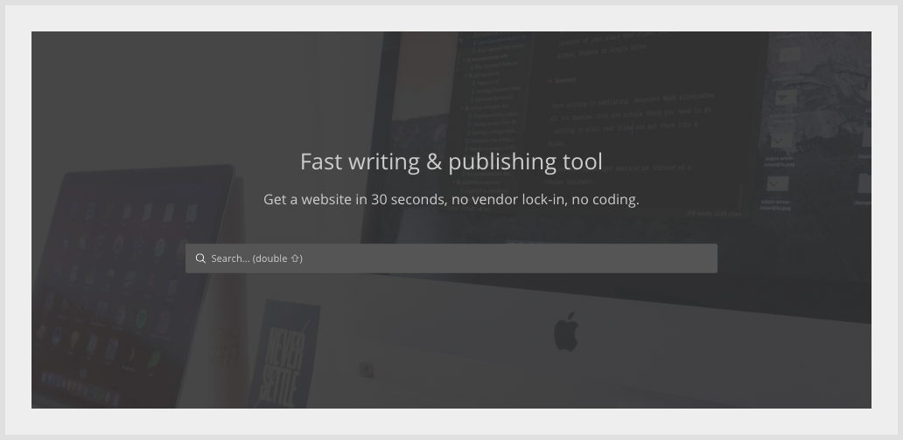
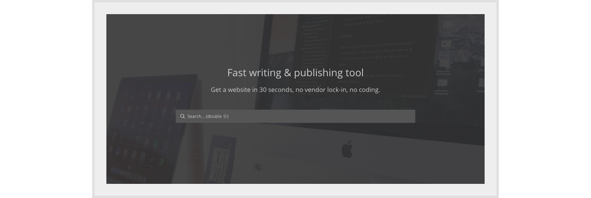
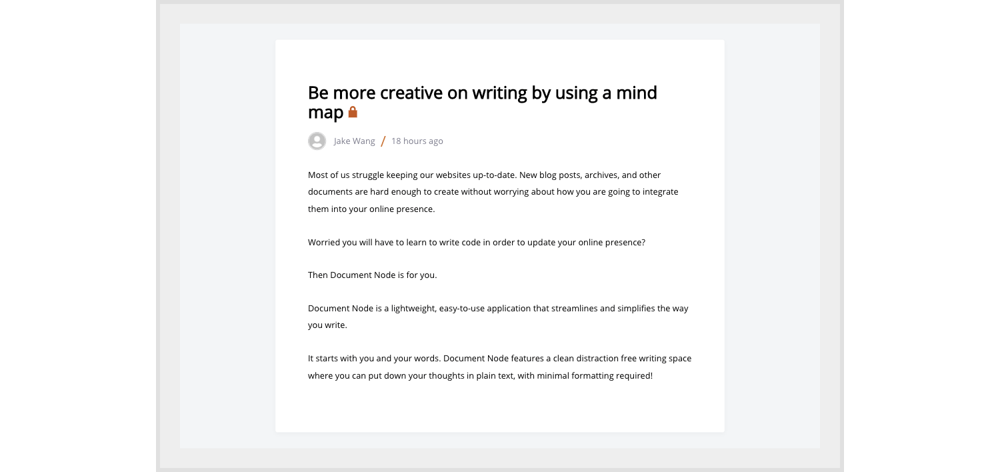
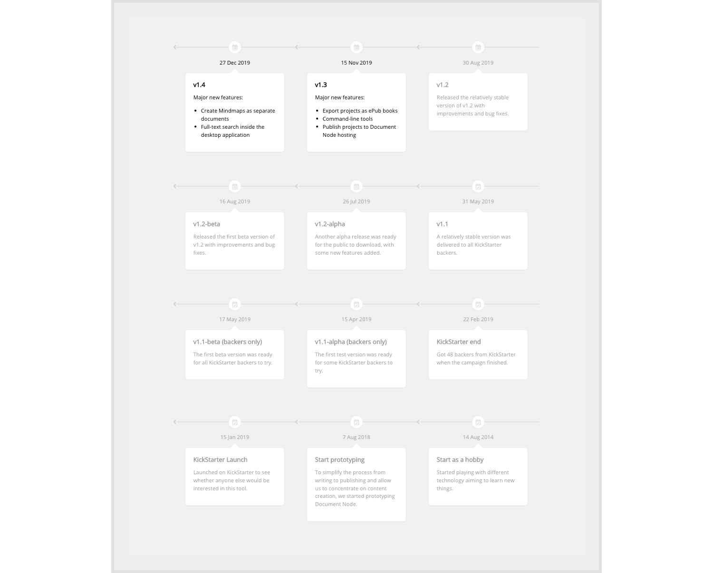
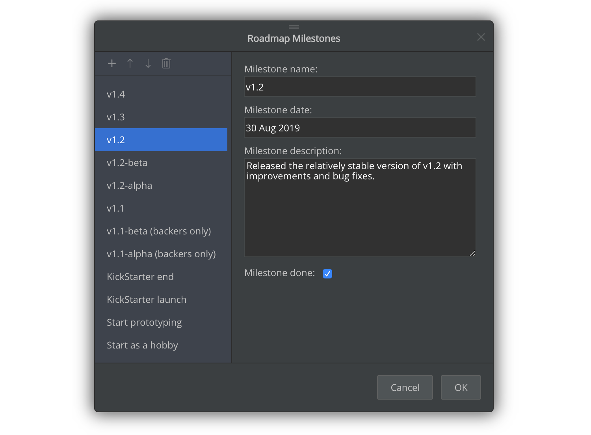

# Version 1.2.143 (beta)

A few more page blocks have been added into this version, which are helpful for creating searching related pages, `Help Center` pages, and roadmap pages.

## Navigation page block with search box

We created a top navigation block with a search box, which can be used in websites that encourage users to search content.

## Hero page block with search box

We added a new hero page block with a search box. It's a great condidate for creating `Help Centre` pages.

Combining this block with other listing page blocks, you can get a professional `Help Center` index page in no time.

## Page block for displaying a help article

If you want to have a simpler format for your articles, you may like the following page block.

It has a title and article content, which is suitable for help articles.

## Page block for displaying a roadmap

To get a living, up-to-date product roadmap instead of a static, presentation-only one, we've created a new page block in this release.

As we are able to change the data of any page blocks in Document Node including this roadmap page block, it's no-brainer to keep your roadmap up-to-date.

## Miscellaneous improvements & fixes

* Fixed the home link of breadcrumb appending back slashes in URL automatically