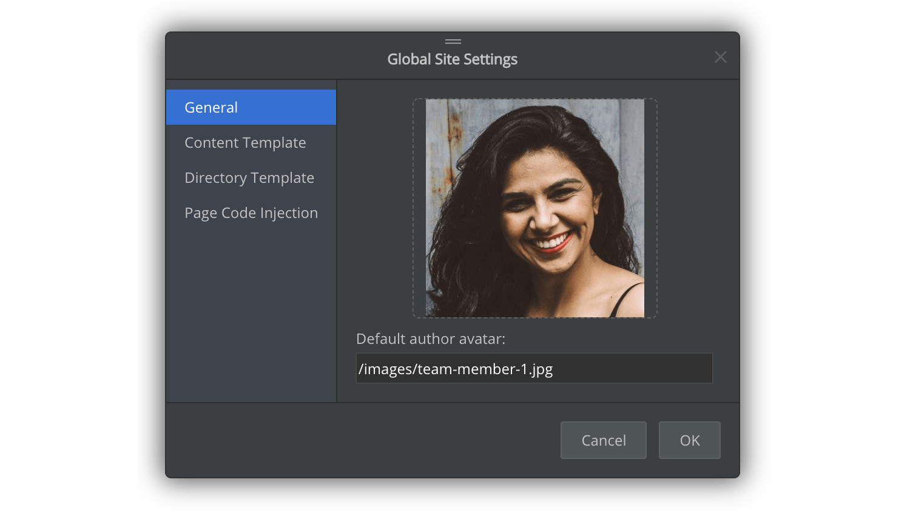

# Version 1.2.144 (beta)

## Improved the 'Global Site Settings' dialogue

This version is a minor update which contains improvements of the `Global Site Settings` dialogue. We refactored the dialogue by using the generic UI components, with a navigation panel on the left side.

This new UI structure makes it much easier to add more global site settings, as we plan to do so gradually.

As shown in the screenshot above, we have added a new setting to allow us to change a default author avatar, which will be shown on blog pages.

This setting can be overridden by the specific page settings, as you may already know, we can edit the avatar image on a particular blog page.

We can also change the content template and directory template. A content template is used to generate a web page from a Markdown file or rich text file. A directory template is used to create a web page from a folder.

While more and more content and directory templates will be added gradually, we will also make it highly customizable so that users can easily create templates by themselves, using HTML/CSS/JavaScript.

Additionally, from this dialogue, we can inject arbitrary code inside `<head></head> or <body></body>` from this dialogue.

This dialog will be further improved to add more global site settings. Please stay tuned.