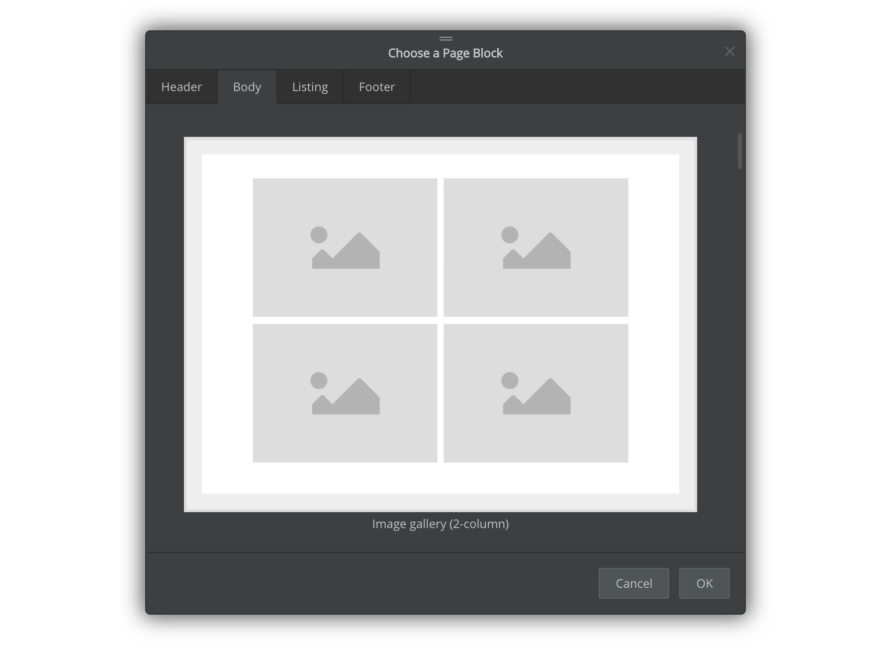
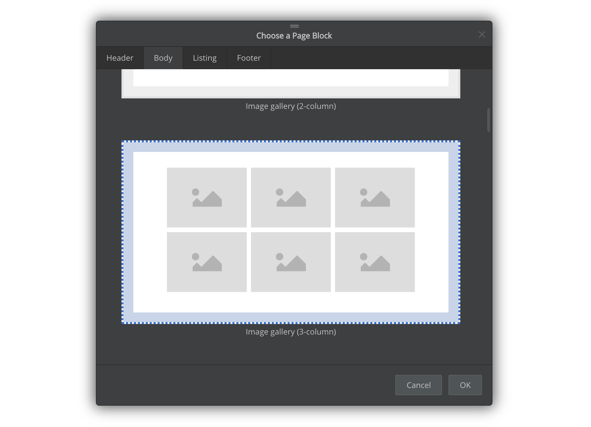

# Version 1.2.147 (stable)

## Tested on more platforms

We tested the Document Node desktop software and command-line tools on several platforms as listed below. It gives us hints about which operating systems are currently supported.

* macOS 10.12
* macOS 10.13
* macOS 10.14
* macOS 10.15
* Windows 7
* Windows 8
* Windows 10
* Ubuntu 16.04
* Ubuntu 18.04
* Ubuntu 19.10
* Fedora 28
* Fedora 29
* Fedora 30
* Fedora 31
* Debian Linux 9
* Debian Linux 10.1
* CentOS 8.0
* MX Linux 18
* Linux Mint 19.2

If Document Node doesn't work for your operating system, please report issues to support@documentnode.io, and we will fix it as soon as possible if your operating system is not obsolete.

## New 'image gallery' page blocks

We added two new page blocks to display an image gallery. One is a two-column layout, the other is a three-column layout.

*Two-column image gallery*

*Three-column image gallery*

## Miscellaneous improvements & fixes

* Fixed browser cache issues spotted from Github Pages hosting
* Added width and height style properties for the site logo
* Tested and fixed problems on macOS Catalina (10.15)
* Fixed issues of not loading user images in the project directory
* Improved the way to generate page titles automatically
* Fixed an issue of Ctrl+K shortcut when selecting a URL
* Fixed a data scope of the Acknowledgement page block