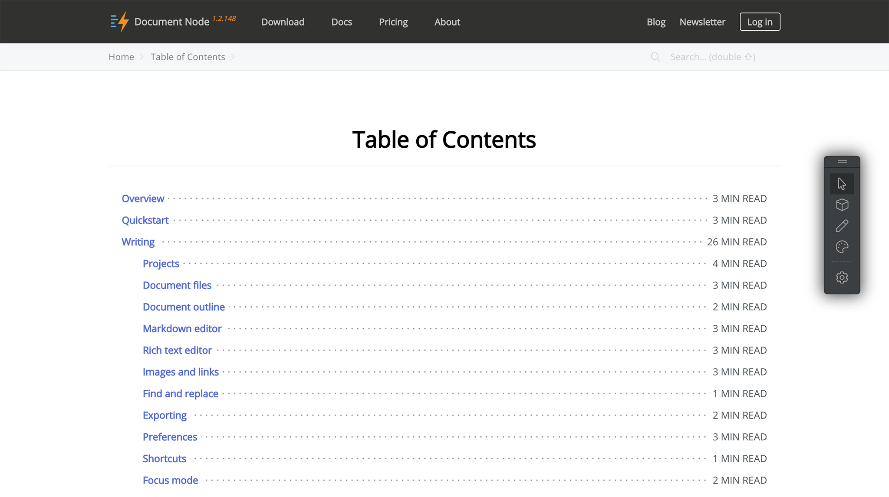

# Version 1.2.148 (stable)

This version is a minor update on the 1.2 major release with a new default page and a couple of bug fixes.

We also updated the document about how to paste screenshots into Document Node directly.

https://documentnode.io/writing/images-and-links#pasting-screenshots-7

We will implement features of built-in screenshots taking in a later version. So that we can start taking screenshots from the text editor, without needing to switch to other applications.

### New default 'Table of Contents' page

In this version, we added a new default page which shows the Table of Contents (TOC) of all articles available on a website. The TOC link is accessible from the article breadcrumbs bar.

It's very helpful when you have many content pages on your website. This TOC page is generated automatically for you based on your document files in your project. If you don't want to show some documents here, you can mark them as `Unlisted` or `Draft` in Document Node.

While `Draft` documents will not be published as web pages at all, `Unlisted` documents will be generated as web pages but not listed in this Table of Contents page and other listing pages.

### Miscellaneous improvements & fixes

* Fixed a linking issue after copying and pasting PDF files into the RichText editor
* Fixed issues of screenshots into the RichText editor