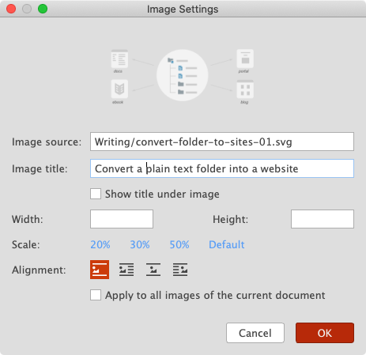

# Version 1.3.0 (beta)

We are so excited to announce that **Document Node 1.3** is now available for everyone to download! This is a major upgrade, which contains new powerful functionalities and heaps of improvements on fine details.

## New UI

We redesigned the GUI and made it even simpler and cleaner. All unnecessary elements were gone, which means less noise and less distraction to users.


Each one of the three columns can be switched `ON` or `OFF` through the intuitive layout switcher button on the top bar.


If the status bar is not something you need all the time, you can hide it from the menu `View` ->`Status Bar` or from the `Preferences` dialogue.

## Customizable Appearance

From this version, it becomes so easy to create your own appearance, as long as you know how to edit simple JSON properties.


When you click "Apply", the application GUI will be updated immediately, so you can preview your changes in real-time.

Document Node provides three built-in appearances:
* Dark
* Light
* Sidebar Dark

On macOS, there is another `Automatic` option, which will follow the system Dark/Light mode. When you change your system to Dark mode or light mode, Document Node will be adjusted to Dark or Light appearance automatically.

## Customizable Preview Style

Now, the preview style can be fully customized using CSS as well. While editing your CSS, you can see your preview page becomes more and more beautiful because of your efforts.


We packed 11 built-in preview styles into the software:
* Blue Danube
* Cherry
* Github
* Nocturne
* Silent Night
* Zestful Blue Danube
* Zestful Cherry
* Zestful Green
* Zestful Leaf
* Zestful Orange
* Zestful Red


Choose a beautiful preview style from the context menu from your current document, or set a global default preview style from the `Preferences` dialogue.

**Copying rich text** enables you to copy the styled page content to somewhere else to post directly. **Opening in browser** and **viewing page source** will unfold all the mysterious, from there, you can do whatever you want.

## Markdown Editor Improvements

Lots of improvements have been made in the Markdown editor, including more formatting options, auto-complete when choosing the code block language, and extended image syntax.


Here is an example of the extended image syntax:

```Markdown

```

If the image description starts with `@`, it means showing the description under the image. Separated by `|`, we can specify the image alignment and size too. However, you don't have to type all these manually. When you move your text cursor into an image block, there will be a `Settings` button shown.


Click the **Settings** button, you will be able to manage the image settings in a dialogue.



## Automatic Backup

User preferences, custom appearance, and custom preview styles will be backed up automatically, to avoid any possibilities of data loss.


By default, the backup folder is created in your home directory. You can change it to a different location if you like.

## One-click Publishing

The most exciting new ability of Document Node should be the one-click publishing! Once you finish creating or modifying your website, click the `Publish` button and give it a subdomain and a custom domain (optional), your website will be published in a few seconds.


Each time when you change your website, use the same button to publish the differences. From now on, every corner of your website can be updated effortlessly.

## Command-line Tools

The command-line tools of the Document Node publisher have been further improved. If you need a high-quality command-line site generator with live-reload, this is the tool you should consider.

It's also designed for teams to integrate the sites generating process into their automation flow.

We appreciate any suggestions and feedback. Please don't hesitate to talk to us.